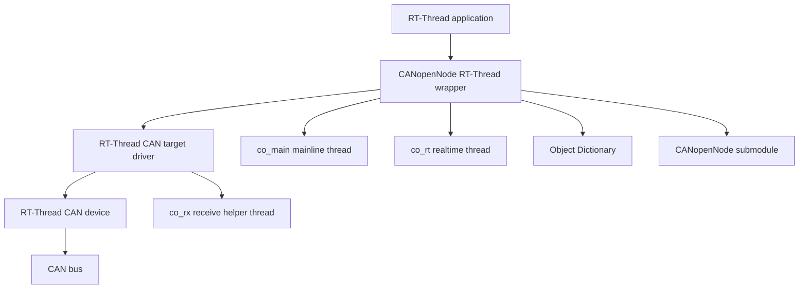

[中文](README.zh-CN.md)

# CANopenNode RT-Thread

[Online Documentation](https://wdfk-prog.space/canopennode-rtt/)

CANopenNode RT-Thread is an RT-Thread integration port for [CANopenNode](https://github.com/CANopenNode/CANopenNode). It provides the RT-Thread CAN device binding, Kconfig options, SCons build integration, runtime thread model, storage backends, and a generated demo Object Dictionary for bring-up.

This repository does not reimplement the CANopen protocol stack. The CANopen protocol core is consumed from the `CANopenNode` git submodule, while this repository provides the RT-Thread target layer and package wrapper.

## Features

- CANopenNode V4-oriented RT-Thread target driver under `port/rtthread/`.
- RT-Thread CAN device binding through the device name configured in Kconfig or passed to `canopen_app_rtt_init()`.
- SCons integration that selects CANopenNode source files according to enabled Kconfig options.
- Runtime model with receive, mainline, and realtime processing threads.
- Optional RT-Thread CAN HDR filter usage when supported by the BSP.
- Optional CiA 301/303/304/305/309 feature groups through Kconfig.
- Optional storage support through RT-Thread DFS, AT24CXX EEPROM, or a user-provided backend.
- Optional CANopen LED mapping to RT-Thread PIN outputs.
- Demo Object Dictionary under `examples/demo_device/` for first bring-up.

## Repository layout

```text
canopennode-rtt/
├── CANopenNode/                 # Upstream CANopenNode git submodule
├── examples/
│   └── demo_device/             # Generated demo OD.c/OD.h and OD project files
├── port/
│   └── rtthread/                # RT-Thread driver, runtime wrapper, storage backends
├── docs/
│   ├── en/                      # English documentation
│   └── zh/                      # Chinese documentation
├── Kconfig                      # RT-Thread package configuration
├── SConscript                   # RT-Thread SCons integration
├── README.md                    # English entry page
└── README.zh-CN.md              # Chinese entry page
```

## Supported environment

The package requires an RT-Thread BSP or application environment with the following core features enabled:

| Requirement | Purpose |
|---|---|
| `RT_USING_HEAP` | Dynamic allocation used by the runtime wrapper and RT-Thread objects. |
| `RT_USING_DEVICE` | RT-Thread device framework. |
| `RT_USING_CAN` | RT-Thread CAN device driver framework. |
| `RT_USING_MUTEX` | CAN send, Emergency, OD, and lifecycle locking. |
| `RT_USING_SEMAPHORE` | CAN RX wakeup and realtime processing wakeup. |

Optional RT-Thread features are used only when their corresponding package options are enabled: `RT_CAN_USING_HDR` for hardware CAN filters, `RT_USING_ULOG` for debug logging, `RT_USING_PIN` for CANopen LEDs, `RT_USING_DFS` for DFS storage, and `PKG_USING_AT24CXX` for EEPROM storage.

## Quick start with RT-Thread

1. Enable the CAN driver in the target RT-Thread BSP and confirm that the CAN device can be found as `can0`, `can1`, or the BSP-specific device name.
2. Clone or update this repository with the `CANopenNode` submodule.
3. Enable `PKG_USING_CANOPENNODE` in `menuconfig`.
4. Configure the CAN device name, Node-ID, bitrate, thread priorities, and the required CANopen feature groups.
5. Build the RT-Thread BSP with SCons.
6. Flash and run the target.
7. Verify that the node sends the CANopen boot-up frame and responds to SDO access if the SDO server is enabled.

See [Quick start](docs/en/quick-start.md) for the detailed procedure.

## Add this package to an RT-Thread project

Use one of the following integration styles, depending on how your RT-Thread project is organized:

1. **Package tree integration**: place this repository in the RT-Thread package tree and expose its `Kconfig` and `SConscript` through the parent package menu.
2. **Application-local package integration**: add this repository to the BSP or application package directory and include it from the project package menu.
3. **Git submodule integration**: add this repository as a submodule in your RT-Thread application repository, then include the package Kconfig/SCons entry from the parent project.

The package root must remain intact because `SConscript` expects `CANopenNode/`, `port/rtthread/`, and `examples/demo_device/` relative to the package root.

## Clone or update submodules

Clone with submodules:

```sh
git clone --recursive <repo-url> canopennode-rtt
cd canopennode-rtt
```

If the repository has already been cloned:

```sh
git submodule update --init --recursive
```

Update the repository and its submodule checkout:

```sh
git pull
git submodule update --init --recursive
```

If the build reports that `CANopenNode` or `CANopenNode/301` is missing, run the submodule update command again from the repository root. See [Submodule update guide](docs/en/submodule-update.md).

## Runtime model



The receive helper dispatches CAN frames to CANopenNode callbacks. The mainline thread runs asynchronous CANopen processing such as NMT, SDO, heartbeat, storage, and reset handling. The realtime thread is woken by a periodic RT-Thread timer and runs time-sensitive SYNC, SRDO, RPDO, and TPDO processing when those objects are enabled.

See [RT-Thread integration](docs/en/rt-thread-integration.md).

## Configuration

Most behavior is controlled through `Kconfig`. Important options include:

| Option | Purpose |
|---|---|
| `PKG_CANOPENNODE_CAN_DEV_NAME` | RT-Thread CAN device name used by auto init and the CAN driver fallback path. |
| `PKG_CANOPENNODE_APP_AUTO_INIT` | Automatically create one default instance at RT-Thread application initialization. |
| `PKG_CANOPENNODE_AUTO_INIT_NODE_ID` | Default Node-ID for auto initialization. |
| `PKG_CANOPENNODE_AUTO_INIT_BITRATE` | Default bitrate for auto initialization. |
| `PKG_CANOPENNODE_TIMER_PERIOD_US` | Realtime CANopen processing period. |
| `PKG_CANOPENNODE_USING_DEMO_OD` | Compile the generated demo Object Dictionary. |
| `PKG_CANOPENNODE_USING_STORAGE` | Enable CANopenNode storage support. |
| `PKG_CANOPENNODE_USING_DEBUG` | Enable RT-Thread ulog diagnostics for this port. |

See [Configuration guide](docs/en/configuration.md) for the option groups and integration notes.

## Manual initialization

Automatic initialization is enabled by default when `PKG_CANOPENNODE_APP_AUTO_INIT` is selected. Disable that option when your application needs to create the instance explicitly.

```c
#include "CO_app_RTT.h"

static CANopenNodeRTT canopen_app;

static int app_canopen_init(void)
{
    return (int)canopen_app_rtt_init(&canopen_app, "can1", 1, 1000);
}
INIT_APP_EXPORT(app_canopen_init);
```

The `CANopenNodeRTT` instance must be zero-initialized before first use. The CAN device name string is stored by reference and must remain valid for the lifetime of the instance.

## Object Dictionary

The default build can compile the generated demo Object Dictionary from `examples/demo_device/` when `PKG_CANOPENNODE_USING_DEMO_OD` is enabled. Product firmware should normally replace this demo OD with a product-specific OD generated from its CANopen object model.

See [Object Dictionary guide](docs/en/object-dictionary.md).

## Documentation

- [Documentation index](docs/en/index.md)
- [Quick start](docs/en/quick-start.md)
- [RT-Thread integration](docs/en/rt-thread-integration.md)
- [Configuration guide](docs/en/configuration.md)
- [Object Dictionary guide](docs/en/object-dictionary.md)
- [Submodule update guide](docs/en/submodule-update.md)
- [Troubleshooting](docs/en/troubleshooting.md)

## Known limitations

- The trace recorder option is intentionally unavailable by default because the current CANopenNode trace module is not ported to the SDO server and Object Dictionary APIs used by this package.
- The built-in AT24CXX EEPROM storage backend is limited to one CANopenNode instance.
- RT-Thread CAN HDR filters are optional. If the BSP does not provide enough hardware filter banks or filter setup fails, the driver falls back to software RX dispatch.
- The package includes a demo OD for bring-up. Production devices should provide their own generated OD and verify PDO, SDO, identity, storage, and persistence settings.

## License

The `CANopenNode` submodule is governed by the license in `CANopenNode/LICENSE`. Keep the appropriate repository-level license information for this RT-Thread port when publishing or redistributing the package.
