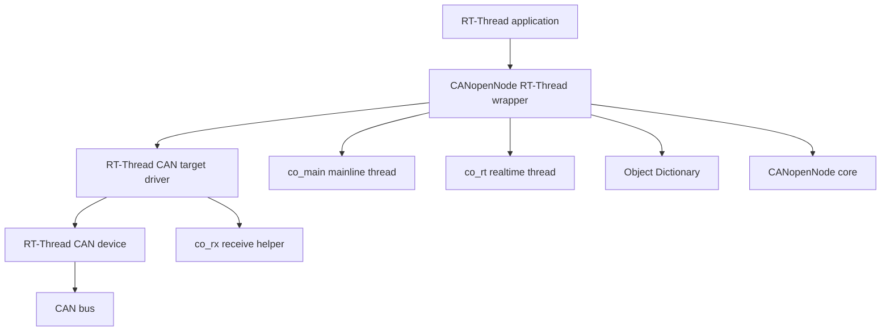

[中文](README.zh-CN.md)

# CANopenNode RT-Thread

[Online Documentation](https://wdfk-prog.space/canopennode-rtt/)

CANopenNode RT-Thread integrates the upstream [CANopenNode](https://github.com/CANopenNode/CANopenNode) stack with RT-Thread. The repository provides the RT-Thread CAN target layer, runtime wrapper, Kconfig/SCons integration, storage adapters, optional CiA 402 components, and a generated demo Object Dictionary for bring-up.

The CANopen protocol core remains in the `CANopenNode` git submodule. This project owns the RT-Thread-facing integration and package-level configuration.

## Main capabilities

- RT-Thread CAN device binding and CANopenNode target-driver adaptation.
- Dedicated receive, mainline, and realtime processing paths.
- Kconfig-controlled CANopenNode feature selection through SCons.
- Optional RT-Thread CAN HDR filter integration with software receive fallback.
- Optional DFS, AT24CXX, or application-provided storage backends.
- LSS Node-ID/bitrate persistence and runtime bitrate switching support.
- Optional CANopen LED, gateway, TIME, EMCY, PDO/SDO, and related CiA 301 feature groups.
- Optional CiA 402 Device and Controller layers, including RT-Thread lifecycle integration and multi-axis Device support.
- Generated demo OD under `examples/demo_device/` and a product-oriented multi-axis CiA 402 OD reference under `examples/cia402_multi_axis_device/`.

## Repository layout

```text
canopennode-rtt/
├── CANopenNode/                 # Upstream CANopenNode submodule
├── port/rtthread/               # RT-Thread target driver and runtime wrapper
├── profile/cia402/              # Optional CiA 402 Device/Controller components
├── examples/
│   ├── demo_device/             # Generated package demo OD
│   └── cia402_multi_axis_device/# Product-oriented CiA 402 OD reference
├── docs/
│   ├── en/                      # English project documentation
│   └── zh/                      # Chinese project documentation
├── Kconfig                      # Package configuration entry
└── SConscript                   # RT-Thread SCons integration
```

## Requirements

The target RT-Thread project must provide the CAN device framework and the RT-Thread kernel objects required by the wrapper. The core package expects:

| Requirement | Purpose |
|---|---|
| `RT_USING_HEAP` | Runtime and RT-Thread object allocation used by enabled features. |
| `RT_USING_DEVICE` | RT-Thread device framework. |
| `RT_USING_CAN` | CAN device framework. |
| `RT_USING_MUTEX` | CAN/OD/lifecycle synchronization. |
| `RT_USING_SEMAPHORE` | RX and realtime wakeup paths. |

Feature-specific dependencies are selected only when needed, including `RT_CAN_USING_HDR`, `RT_USING_ULOG`, `RT_USING_PIN`, `RT_USING_DFS`, and `PKG_USING_AT24CXX`.

## Quick start

1. Enable a CAN device in the target BSP and confirm its RT-Thread device name.
2. Clone this repository with the `CANopenNode` submodule.
3. Enable `PKG_USING_CANOPENNODE` in `menuconfig`.
4. Configure the CAN device name, Node-ID, bitrate, runtime threads, and required CANopen feature groups.
5. Build and flash the BSP using the project's normal RT-Thread workflow.
6. Start the target and confirm the node enters normal CANopen operation.

Clone with submodules:

```sh
git clone --recursive <repo-url> canopennode-rtt
cd canopennode-rtt
```

For an existing checkout:

```sh
git submodule update --init --recursive
```

See [Quick start](docs/en/quick-start.md) and [Submodule update](docs/en/submodule-update.md).

## Runtime architecture


```mermaid
flowchart TD
    App[RT-Thread application] --> Wrapper[CANopenNode RT-Thread wrapper]
    Wrapper --> Driver[RT-Thread CAN target driver]
    Driver --> CANDev[RT-Thread CAN device]
    Driver --> Rx[co_rx receive helper]
    Wrapper --> Main[co_main mainline thread]
    Wrapper --> RealTime[co_rt realtime thread]
    Wrapper --> OD[Object Dictionary]
    Wrapper --> Core[CANopenNode core]
    CANDev --> Bus[CAN bus]
```

The receive helper dispatches CAN frames to CANopenNode callbacks. `co_main` processes asynchronous protocol work and reset/lifecycle handling. `co_rt` is driven by the realtime timer and executes enabled SYNC/SRDO/RPDO/TPDO work. Optional lifecycle extensions, including the CiA 402 Device adapter, are attached through the generic lifecycle registry instead of being embedded in the core wrapper.

See [RT-Thread integration](docs/en/rt-thread-integration.md).

## Configuration entry points

Frequently used options include:

| Option | Purpose |
|---|---|
| `PKG_CANOPENNODE_CAN_DEV_NAME` | RT-Thread CAN device used by the default path. |
| `PKG_CANOPENNODE_APP_AUTO_INIT` | Create one default CANopenNode instance during RT-Thread application initialization. |
| `PKG_CANOPENNODE_AUTO_INIT_NODE_ID` | Default Node-ID for automatic initialization. |
| `PKG_CANOPENNODE_AUTO_INIT_BITRATE` | Default bitrate for automatic initialization. |
| `PKG_CANOPENNODE_TIMER_PERIOD_US` | Realtime processing timer period. |
| `PKG_CANOPENNODE_USING_DEMO_OD` | Compile the generated demo Object Dictionary. |
| `PKG_CANOPENNODE_USING_STORAGE` | Enable CANopenNode storage integration. |
| `PKG_CANOPENNODE_USING_DEBUG` | Enable RT-Thread ulog integration for this port. |
| `PKG_CANOPENNODE_CIA402` | Enable the optional CiA 402 feature group. |

See [Configuration guide](docs/en/configuration.md) for the complete option groups and dependency notes.

## Manual initialization

Disable `PKG_CANOPENNODE_APP_AUTO_INIT` when the application owns instance creation explicitly:

```c
#include "CO_app_RTT.h"

static CANopenNodeRTT canopenApp;

static int app_canopen_init(void)
{
    return (int)canopen_app_rtt_init(&canopenApp, "can1", 1U, 1000U);
}
INIT_APP_EXPORT(app_canopen_init);
```

`CANopenNodeRTT` must be zero-initialized before first use. The CAN device-name string is stored by reference and must remain valid for the instance lifetime.

## Object Dictionary

`examples/demo_device/` contains the generated package demo OD. Product firmware should normally provide its own generated `OD.c`/`OD.h` and disable `PKG_CANOPENNODE_USING_DEMO_OD`.

The demo OD also contains optional manufacturer-specific diagnostic/control objects used by package demo modules. They are not part of the standard CANopen application profile and should not be treated as product interfaces unless the product deliberately adopts an equivalent contract.

See [Object Dictionary](docs/en/object-dictionary.md).

## CiA 402

The optional CiA 402 support is split into reusable layers:

- [Pure-C Device core and OD binding](docs/en/cia402-device-core.md): multi-axis PDS supervision, OD binding, DriveIF ownership, and mode interfaces.
- [RT-Thread Device integration](docs/en/cia402-device-rtt.md): lifecycle registry, worker thread, lock order, automatic construction, and Communication Reset handling.
- [Device diagnostics and product integration](docs/en/cia402.md): per-axis Error-code/EMCY integration and product OD guidance.
- [Controller API](docs/en/cia402-controller.md): transport-agnostic PDS Controlword sequencing for remote drives.

## Documentation

Start from the [documentation index](docs/en/index.md). The main project documents cover quick integration, runtime architecture, configuration, Object Dictionary integration, high-resolution time, LSS persistence, CiA 402, submodule maintenance, and troubleshooting.

## Known constraints

- CANopenNode trace support is intentionally unavailable until the trace module is adapted to the currently used SDO server and Object Dictionary APIs.
- The built-in AT24CXX storage backend is limited to one CANopenNode instance.
- RT-Thread CAN HDR filtering is optional; the driver can fall back to software RX dispatch when hardware filters are unavailable or cannot be configured.
- The built-in demo OD is intended for package bring-up. Product firmware should use a product-specific generated OD and own its identity, PDO layout, storage policy, and application objects.

## License

The `CANopenNode` submodule is licensed according to `CANopenNode/LICENSE`. Preserve all applicable repository and upstream license information when redistributing this package.
