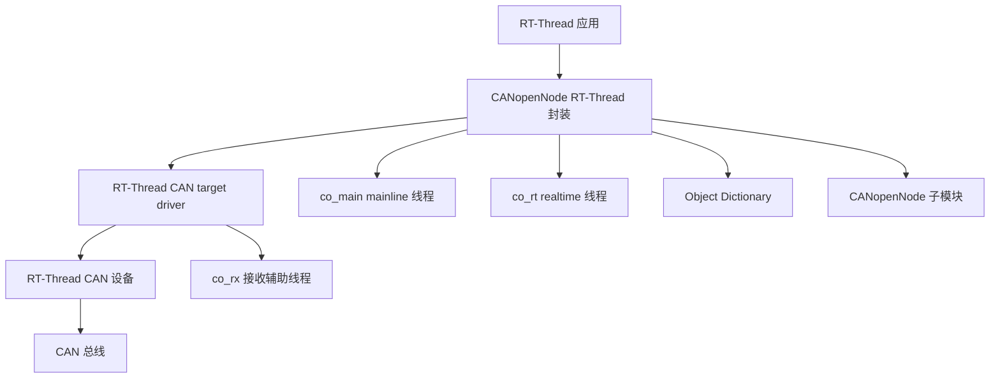

[English](README.md)

# CANopenNode RT-Thread

[在线文档](https://wdfk-prog.space/canopennode-rtt/)

CANopenNode RT-Thread 是面向 [CANopenNode](https://github.com/CANopenNode/CANopenNode) 的 RT-Thread 集成移植层，提供 RT-Thread CAN 设备绑定、Kconfig 配置、SCons 构建接入、运行线程模型、存储后端以及用于 bring-up 的 demo Object Dictionary。

本仓库不重新实现 CANopen 协议栈。CANopen 协议核心来自 `CANopenNode` git 子模块；本仓库主要提供 RT-Thread target 层和 package wrapper。

## 功能特性

- 面向 CANopenNode V4 的 RT-Thread target driver，位于 `port/rtthread/`。
- 通过 Kconfig 配置或 `canopen_app_rtt_init()` 参数绑定 RT-Thread CAN 设备。
- 通过 SCons 按 Kconfig 选项选择 CANopenNode 源文件。
- 提供 RX、mainline、realtime 三类运行线程模型。
- BSP 支持时可选用 RT-Thread CAN HDR 硬件过滤器。
- 通过 Kconfig 裁剪 CiA 301/303/304/305/309 功能组。
- 支持 RT-Thread DFS、AT24CXX EEPROM 或用户自定义 storage backend。
- 可选将 CANopen LED 状态映射到 RT-Thread PIN 输出。
- `examples/demo_device/` 提供 demo Object Dictionary，便于首次联调。

## 仓库结构

```text
canopennode-rtt/
├── CANopenNode/                 # 上游 CANopenNode git 子模块
├── examples/
│   └── demo_device/             # 生成的 demo OD.c/OD.h 和 OD 工程文件
├── port/
│   └── rtthread/                # RT-Thread 驱动、运行封装、storage backend
├── docs/
│   ├── en/                      # 英文文档
│   └── zh/                      # 中文文档
├── Kconfig                      # RT-Thread package 配置
├── SConscript                   # RT-Thread SCons 接入
├── README.md                    # 英文首页
└── README.zh-CN.md              # 中文首页
```

## 支持环境

本软件包要求目标 RT-Thread BSP 或应用环境启用以下核心能力：

| 依赖 | 用途 |
|---|---|
| `RT_USING_HEAP` | 运行封装和 RT-Thread 对象需要动态分配。 |
| `RT_USING_DEVICE` | RT-Thread 设备框架。 |
| `RT_USING_CAN` | RT-Thread CAN 设备驱动框架。 |
| `RT_USING_MUTEX` | CAN 发送、Emergency、OD 和生命周期互斥保护。 |
| `RT_USING_SEMAPHORE` | CAN RX 唤醒和 realtime 处理唤醒。 |

可选 RT-Thread 能力仅在对应软件包选项开启时使用：`RT_CAN_USING_HDR` 用于硬件 CAN 过滤器，`RT_USING_ULOG` 用于调试日志，`RT_USING_PIN` 用于 CANopen LED，`RT_USING_DFS` 用于 DFS 存储，`PKG_USING_AT24CXX` 用于 EEPROM 存储。

## RT-Thread 快速接入

1. 在目标 RT-Thread BSP 中启用 CAN 驱动，并确认 CAN 设备名为 `can0`、`can1` 或 BSP 实际导出的设备名。
2. 拉取本仓库以及 `CANopenNode` 子模块。
3. 在 `menuconfig` 中开启 `PKG_USING_CANOPENNODE`。
4. 配置 CAN 设备名、Node-ID、bitrate、线程优先级以及所需 CANopen 功能组。
5. 使用 SCons 构建 RT-Thread BSP。
6. 烧录并运行目标板。
7. 通过 CAN 总线确认节点发送 CANopen boot-up 帧；如果启用了 SDO server，再确认 SDO 访问正常。

详细流程见：[快速接入](docs/zh/quick-start.md)。

## 添加到 RT-Thread 工程

根据 RT-Thread 工程组织方式，可以选择以下接入方式之一：

1. **软件包树接入**：将本仓库放入 RT-Thread package tree，并通过上层 package menu 暴露本仓库的 `Kconfig` 和 `SConscript`。
2. **应用本地软件包接入**：将本仓库放入 BSP 或应用软件包目录，并从工程 package menu 引入。
3. **Git 子模块接入**：将本仓库作为应用工程的子模块，然后由父工程引入本包的 Kconfig/SCons 入口。

软件包根目录必须保持完整，因为 `SConscript` 会按相对路径查找 `CANopenNode/`、`port/rtthread/` 和 `examples/demo_device/`。

## 拉取或更新 Git 子模块

克隆仓库并同时拉取子模块：

```sh
git clone --recursive <repo-url> canopennode-rtt
cd canopennode-rtt
```

如果仓库已经克隆：

```sh
git submodule update --init --recursive
```

更新仓库和子模块：

```sh
git pull
git submodule update --init --recursive
```

如果构建时报 `CANopenNode` 或 `CANopenNode/301` 缺失，请在仓库根目录重新执行子模块更新命令。更多说明见：[子模块更新说明](docs/zh/submodule-update.md)。

## 运行模型



接收辅助线程负责从 RT-Thread CAN 设备读取 CAN 帧并派发到 CANopenNode 回调。mainline 线程处理 NMT、SDO、heartbeat、storage 和 reset 等异步 CANopen 逻辑。realtime 线程由周期性 RT-Thread timer 唤醒，在对应对象启用时处理 SYNC、SRDO、RPDO 和 TPDO 等实时路径。

详见：[RT-Thread 集成说明](docs/zh/rt-thread-integration.md)。

## 配置说明

大部分行为由 `Kconfig` 控制。关键选项包括：

| 选项 | 用途 |
|---|---|
| `PKG_CANOPENNODE_CAN_DEV_NAME` | auto init 和 CAN driver fallback 共用的 RT-Thread CAN 设备名。 |
| `PKG_CANOPENNODE_APP_AUTO_INIT` | 在 RT-Thread 应用初始化阶段自动创建一个默认实例。 |
| `PKG_CANOPENNODE_AUTO_INIT_NODE_ID` | 自动初始化使用的默认 Node-ID。 |
| `PKG_CANOPENNODE_AUTO_INIT_BITRATE` | 自动初始化使用的默认 bitrate。 |
| `PKG_CANOPENNODE_TIMER_PERIOD_US` | realtime CANopen 处理周期。 |
| `PKG_CANOPENNODE_USING_DEMO_OD` | 编译生成的 demo Object Dictionary。 |
| `PKG_CANOPENNODE_USING_STORAGE` | 启用 CANopenNode storage 支持。 |
| `PKG_CANOPENNODE_USING_DEBUG` | 启用本移植层的 RT-Thread ulog 诊断日志。 |

完整说明见：[配置指南](docs/zh/configuration.md)。

## 手动初始化

默认可通过 `PKG_CANOPENNODE_APP_AUTO_INIT` 自动初始化。若应用需要显式创建实例，应关闭该选项。

```c
#include "CO_app_RTT.h"

static CANopenNodeRTT canopen_app;

static int app_canopen_init(void)
{
    return (int)canopen_app_rtt_init(&canopen_app, "can1", 1, 1000);
}
INIT_APP_EXPORT(app_canopen_init);
```

`CANopenNodeRTT` 实例首次使用前必须为零初始化。CAN 设备名字符串只保存指针，不复制内容，因此该字符串在实例生命周期内必须保持有效。

## Object Dictionary

默认构建可在 `PKG_CANOPENNODE_USING_DEMO_OD` 开启时编译 `examples/demo_device/` 下生成的 demo Object Dictionary。产品固件通常应替换为基于自身 CANopen 对象模型生成的 OD。

详见：[Object Dictionary 指南](docs/zh/object-dictionary.md)。

## 文档

- [文档索引](docs/zh/index.md)
- [快速接入](docs/zh/quick-start.md)
- [RT-Thread 集成说明](docs/zh/rt-thread-integration.md)
- [配置指南](docs/zh/configuration.md)
- [Object Dictionary 指南](docs/zh/object-dictionary.md)
- [子模块更新说明](docs/zh/submodule-update.md)
- [故障排查](docs/zh/troubleshooting.md)

## 已知限制

- trace recorder 选项默认不可用，因为当前 CANopenNode trace 模块尚未适配本包使用的 SDO server 和 Object Dictionary API。
- 内置 AT24CXX EEPROM storage backend 限制为单个 CANopenNode 实例。
- RT-Thread CAN HDR 硬件过滤器是可选能力。如果 BSP 过滤器 bank 不足或配置失败，驱动会回退到软件 RX 分发。
- 本仓库自带 demo OD 仅用于 bring-up。产品化设备应提供自己的生成 OD，并验证 PDO、SDO、identity、storage 和持久化配置。

## 许可证

`CANopenNode` 子模块遵循 `CANopenNode/LICENSE` 中的许可证。发布或再分发本 RT-Thread 移植包时，应保留适用的仓库级许可证信息。
