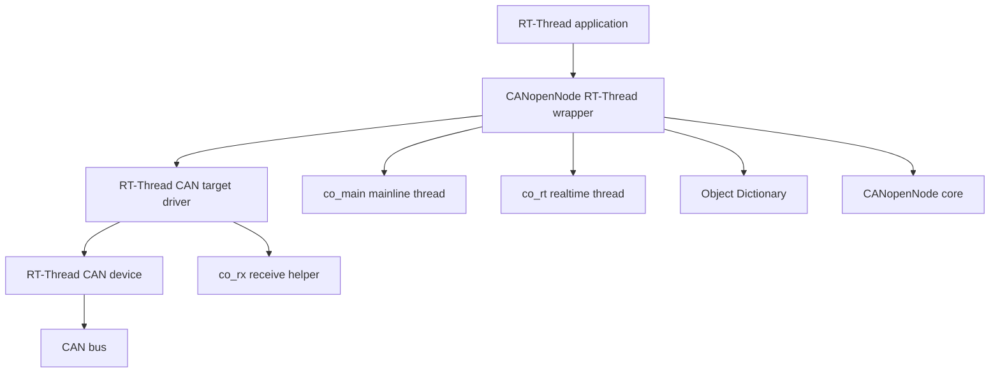

[English](README.md)

# CANopenNode RT-Thread

[在线文档](https://wdfk-prog.space/canopennode-rtt/)

CANopenNode RT-Thread 用于把上游 [CANopenNode](https://github.com/CANopenNode/CANopenNode) 协议栈接入 RT-Thread。仓库提供 RT-Thread CAN target 层、运行时封装、Kconfig/SCons 集成、Storage 适配、可选 CiA 402 组件，以及用于 bring-up 的生成式 demo Object Dictionary。

CANopen 协议核心仍由 `CANopenNode` git submodule 提供；本仓库负责 RT-Thread 侧适配和 package 级配置。

## 主要能力

- RT-Thread CAN device 绑定与 CANopenNode target driver 适配。
- 独立的接收、mainline 和 realtime 处理路径。
- 通过 Kconfig 控制 CANopenNode 功能，并由 SCons 按配置选择源码。
- 可选 RT-Thread CAN HDR 硬件过滤；不可用时回退到软件 RX 分发。
- 可选 DFS、AT24CXX 或应用自定义 Storage backend。
- LSS Node-ID/bitrate 持久化和运行时 bitrate 切换。
- 可选 CANopen LED、Gateway、TIME、EMCY、PDO/SDO 等 CiA 301 功能组。
- 可选 CiA 402 Device/Controller，包括 RT-Thread lifecycle 集成和多轴 Device 支持。
- `examples/demo_device/` 提供生成式 demo OD；`examples/cia402_multi_axis_device/` 提供面向产品集成的多轴 CiA 402 OD 参考。

## 仓库结构

```text
canopennode-rtt/
├── CANopenNode/                 # 上游 CANopenNode submodule
├── port/rtthread/               # RT-Thread target driver 与运行时封装
├── profile/cia402/              # 可选 CiA 402 Device/Controller
├── examples/
│   ├── demo_device/             # package demo OD 生成物
│   └── cia402_multi_axis_device/# 产品式 CiA 402 OD 参考
├── docs/
│   ├── en/                      # 英文项目文档
│   └── zh/                      # 中文项目文档
├── Kconfig                      # package 配置入口
└── SConscript                   # RT-Thread SCons 集成
```

## 运行环境要求

目标 RT-Thread 工程需要提供 CAN device framework 和运行时封装依赖的内核对象：

| 依赖 | 用途 |
|---|---|
| `RT_USING_HEAP` | 已启用功能所需的运行时与 RT-Thread 对象分配。 |
| `RT_USING_DEVICE` | RT-Thread device framework。 |
| `RT_USING_CAN` | CAN device framework。 |
| `RT_USING_MUTEX` | CAN、OD 与 lifecycle 同步。 |
| `RT_USING_SEMAPHORE` | RX 与 realtime 唤醒路径。 |

其他依赖只在对应功能开启时使用，例如 `RT_CAN_USING_HDR`、`RT_USING_ULOG`、`RT_USING_PIN`、`RT_USING_DFS` 和 `PKG_USING_AT24CXX`。

## 快速接入

1. 在目标 BSP 中启用 CAN 驱动，并确认 RT-Thread CAN device 名称。
2. 克隆本仓库并初始化 `CANopenNode` submodule。
3. 在 `menuconfig` 中启用 `PKG_USING_CANOPENNODE`。
4. 配置 CAN device、Node-ID、bitrate、运行线程和所需 CANopen 功能组。
5. 按工程现有 RT-Thread 流程构建并烧录 BSP。
6. 启动目标节点，确认 CANopenNode 正常进入运行状态。

带 submodule 克隆：

```sh
git clone --recursive <repo-url> canopennode-rtt
cd canopennode-rtt
```

已有仓库补齐 submodule：

```sh
git submodule update --init --recursive
```

详细步骤见[快速接入](docs/zh/quick-start.md)和[子模块更新](docs/zh/submodule-update.md)。

## 运行时架构


```mermaid
flowchart TD
    App[RT-Thread application] --> Wrapper[CANopenNode RT-Thread wrapper]
    Wrapper --> Driver[RT-Thread CAN target driver]
    Driver --> CANDev[RT-Thread CAN device]
    Driver --> Rx[co_rx receive helper]
    Wrapper --> Main[co_main mainline thread]
    Wrapper --> RealTime[co_rt realtime thread]
    Wrapper --> OD[Object Dictionary]
    Wrapper --> Core[CANopenNode core]
    CANDev --> Bus[CAN bus]
```

接收线程把 CAN 帧分发给 CANopenNode callback；`co_main` 处理异步协议任务以及 reset/lifecycle；`co_rt` 由 realtime timer 驱动，并执行已启用的 SYNC/SRDO/RPDO/TPDO 路径。CiA 402 Device 等可选扩展通过通用 lifecycle registry 挂载，不直接嵌入核心 wrapper。

详细说明见 [RT-Thread 集成](docs/zh/rt-thread-integration.md)。

## 主要配置入口

| 选项 | 作用 |
|---|---|
| `PKG_CANOPENNODE_CAN_DEV_NAME` | 默认路径使用的 RT-Thread CAN device。 |
| `PKG_CANOPENNODE_APP_AUTO_INIT` | 在 RT-Thread application init 中创建一个默认 CANopenNode 实例。 |
| `PKG_CANOPENNODE_AUTO_INIT_NODE_ID` | 自动初始化默认 Node-ID。 |
| `PKG_CANOPENNODE_AUTO_INIT_BITRATE` | 自动初始化默认 bitrate。 |
| `PKG_CANOPENNODE_TIMER_PERIOD_US` | realtime 处理 timer 周期。 |
| `PKG_CANOPENNODE_USING_DEMO_OD` | 编译生成式 demo Object Dictionary。 |
| `PKG_CANOPENNODE_USING_STORAGE` | 启用 CANopenNode Storage 集成。 |
| `PKG_CANOPENNODE_USING_DEBUG` | 启用本移植层的 RT-Thread ulog。 |
| `PKG_CANOPENNODE_CIA402` | 启用可选 CiA 402 功能组。 |

完整选项和依赖关系见[配置指南](docs/zh/configuration.md)。

## 手动初始化

应用需要显式创建实例时关闭 `PKG_CANOPENNODE_APP_AUTO_INIT`：

```c
#include "CO_app_RTT.h"

static CANopenNodeRTT canopenApp;

static int app_canopen_init(void)
{
    return (int)canopen_app_rtt_init(&canopenApp, "can1", 1U, 1000U);
}
INIT_APP_EXPORT(app_canopen_init);
```

`CANopenNodeRTT` 首次使用前必须清零。CAN device name 只保存引用，因此字符串必须覆盖实例整个生命周期。

## Object Dictionary

`examples/demo_device/` 包含 package 自带的生成式 demo OD。产品固件通常应提供自己的生成 `OD.c/OD.h`，并关闭 `PKG_CANOPENNODE_USING_DEMO_OD`。

Demo OD 还包含若干 manufacturer-specific 诊断/控制对象，供 package demo 功能使用。这些对象不是标准 CANopen application profile 的组成部分，也不应自动视为产品公开接口。

详细说明见 [Object Dictionary](docs/zh/object-dictionary.md)。

## CiA 402

可选 CiA 402 支持按职责拆分：

- [Pure-C Device Core 与 OD Binding](docs/zh/cia402-device-core.md)：多轴 PDS supervisor、OD binding、DriveIF ownership 与 mode 接口。
- [RT-Thread Device 集成](docs/zh/cia402-device-rtt.md)：lifecycle registry、worker thread、锁顺序、自动构造和 Communication Reset。
- [Device 诊断与产品集成](docs/zh/cia402.md)：每轴 Error-code/EMCY 绑定以及产品 OD 使用方式。
- [Controller API](docs/zh/cia402-controller.md)：与传输无关的远端 PDS Controlword 状态推进。

## 项目文档

从[文档索引](docs/zh/index.md)开始。项目文档重点覆盖快速接入、运行时架构、配置、Object Dictionary、High-Resolution Time、LSS 持久化、CiA 402、子模块维护和故障排查。

## 已知约束

- CANopenNode trace 暂不可用，直到 trace 模块适配当前 SDO server 与 Object Dictionary API。
- 内置 AT24CXX Storage backend 仅支持单个 CANopenNode 实例。
- RT-Thread CAN HDR 过滤为可选能力；硬件过滤不可用或配置失败时可回退到软件 RX 分发。
- 自带 demo OD 用于 package bring-up。产品固件应使用产品自己的生成 OD，并自行确定 identity、PDO 布局、Storage policy 和 application object。

## 许可证

`CANopenNode` submodule 遵循 `CANopenNode/LICENSE`。发布或再分发本 package 时应保留仓库及上游适用的许可证信息。
