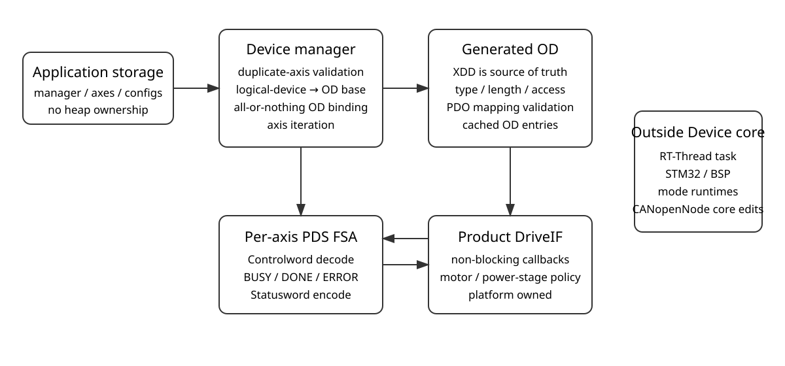

[中文](../zh/cia402-device-core.md)

# CiA 402 Pure-C Device Core and OD Binding

This page documents the Stage A3 implementation boundary and runtime contract. A3 builds the multi-axis Device PDS core in pure C without adding RT-Thread, STM32/BSP, or runtime OD-generation dependencies.

## 1. What A3 provides

A3 binds XDD-generated CiA 402 objects to a local multi-axis runtime and runs an independent PDS supervisor for each axis:

- `CO_402_device_manager_t` owns references to caller-owned axis/config/runtime arrays;
- each `logicalDevice` maps to its profile OD base;
- duplicate logical-device configurations are rejected;
- required OD entries are found, validated, and cached per axis;
- controlled OD-extension ownership is established for Controlword and Modes of operation;
- Controlword is decoded, the PDS state is supervised, and Statusword is encoded;
- `CO_402_drive_if_t` isolates the protocol state machine from product motor/power-stage code;
- `BUSY/DONE/ERROR` allows DriveIF transitions to span multiple supervisor cycles;
- manager, axis, config, and DriveIF storage is application-owned; A3 allocates no heap memory.



A3 does not implement an RT-Thread worker, STM32 HAL, PWM/ADC/FOC, PP/PV/HM/CSP/CSV/CST mode runtimes, or changes under `CANopenNode/` core.

## 2. Multi-axis logical-device to OD base mapping

`logicalDevice` is a zero-based logical-device number. The current common helper uses a 0x0800 profile-instance stride:

```text
odBase = 0x6000 + logicalDevice * 0x0800
object = odBase + (axis0Index - 0x6000)
```

| logicalDevice | OD base | Controlword | Statusword |
|---:|---:|---:|---:|
| 0 | `0x6000` | `0x6040` | `0x6041` |
| 1 | `0x6800` | `0x6840` | `0x6841` |
| 2 | `0x7000` | `0x7040` | `0x7041` |

Configured logical devices do not have to be contiguous; for example, logical devices 0 and 2 can be used together. Selecting the same logical device for two axes returns `CO_402_INIT_DUPLICATE_AXIS`.

## 3. OD binding contract

The XDD and generated `OD.c`/`OD.h` remain the source of truth for object existence and semantic data types. A3 never creates hidden OD entries; it validates only structure and attributes visible through the CANopenNode runtime OD.

Each configured axis currently requires:

| Axis0 index | Meaning | Length | A3 access/mapping contract |
|---:|---|---:|---|
| `0x603F` | Error code | 2 | SDO-R, MB |
| `0x6040` | Controlword | 2 | SDO-RW, RPDO, MB |
| `0x6041` | Statusword | 2 | SDO-R, TPDO, MB |
| `0x6060` | Modes of operation | 1 | SDO-RW, RPDO |
| `0x6061` | Modes of operation display | 1 | SDO-R, TPDO |
| `0x6064` | Position actual value | 4 | SDO-R, TPDO, MB |
| `0x606C` | Velocity actual value | 4 | SDO-R, TPDO, MB |
| `0x607A` | Target position | 4 | SDO-RW, RPDO, MB |
| `0x60FF` | Target velocity | 4 | SDO-RW, RPDO, MB |
| `0x6502` | Supported drive modes | 4 | SDO-R, MB |

Initialization checks that:

1. the object exists;
2. the OD entry is a scalar `VAR` with only sub-index zero;
3. byte length matches the contract;
4. all runtime-visible attributes match the A3 contract, including rejection of undeclared SRDO mapping and `ODA_STR`;
5. Controlword/Modes-of-operation extensions are not owned by another subsystem.

Forwarding extensions are installed only after all axes and required objects pass validation, so a validation failure does not leave a manager with newly installed partial extensions.

> The current CANopenNode runtime OD metadata does not retain the complete semantic XDD data type, such as the signed/unsigned type name. A3 can therefore validate object code, sub-index structure, byte width, and access/mapping at runtime; semantic INTEGER/UNSIGNED typing remains an XDD/generated-artifact responsibility. This is not a CiA 402 conformance claim.

## 4. PDS supervisor and DriveIF

Each `CO_402_device_process()` call runs at most one PDS state handler per axis. A DriveIF callback returning `BUSY` normally keeps exclusive ownership and is retried on the next supervisor cycle without blocking the caller. Quick-stop or Disable-voltage may transfer that ownership at a callback boundary, and fault reaction has higher priority still; the incoming safety callback must synchronously supersede the physical action left BUSY by the retired owner before returning.

Current DriveIF transition callbacks are:

| Callback | PDS purpose |
|---|---|
| `shutdown` | Complete product actions required for Ready to switch on |
| `switchOn` | Complete the transition to Switched on |
| `enableOperation` | Enter Operation enabled |
| `disableVoltage` | Remove drive voltage and enter Switch on disabled |
| `disableOperation` | Leave Operation enabled for Switched on |
| `quickStop` | Start/continue the product quick-stop action |
| `faultReaction` | Execute the product fault reaction |
| `faultReset` | Execute an allowed fault reset |

Result semantics are:

- `CO_402_DRIVE_BUSY`: keep the current state and owner for ordinary requests; a stricter safety request may replace that owner at the next callback boundary;
- `CO_402_DRIVE_DONE`: commit the target PDS state;
- `CO_402_DRIVE_ERROR`: normal transitions enter Fault reaction active; completion or failure of fault reaction enters Fault.

A3 does not treat Controlword `0x000F` as an automatic multi-state shortcut from Switch on disabled or Ready to switch on; the host/controller must sequence states explicitly. Quick stop active also does not use `0x000F` to resume Operation enabled because A3 does not yet bind the Quick stop option code and its policy. No recovery policy is invented before the corresponding normative matrix and OD contract are available.

Fault Reset uses a separate edge-triggered transaction. The supervisor records Controlword bit 7 after every successful snapshot, and only a newly observed `0 -> 1` while the axis is in Fault starts `faultReset`. A `BUSY` result latches that accepted transaction and continues it across later cycles until `DONE` or `ERROR`; normal Controlword state commands do not preempt an accepted Fault Reset. A Controlword read failure does preempt it into fault reaction. Holding bit 7 high cannot automatically reset a later Fault. Normal PDS command decoding ignores bit 7, so a stale high Fault Reset level does not suppress Shutdown, Enable operation, or other normal state commands.

## 5. Lifetime and no-heap contract

The application must keep these objects alive for the complete manager lifetime:

```c
CO_402_device_manager_t manager;
CO_402_device_axis_t axes[AXIS_COUNT];
CO_402_device_axis_config_t configs[AXIS_COUNT];
```

`configs[*].drive` and `configs[*].driveObject` must remain valid as well. A3 does not call `malloc/calloc/realloc/free` and owns no RT-Thread object.

## 6. Optional logging hook

The Pure-C CiA 402 code only calls the `CO_402_LOG_E/W/I/D` macros. They default to no-ops and introduce no `printf`, RT-Thread, ulog, or BSP dependency. Log points are limited to actual PDS state changes, DriveIF errors, Controlword read failures, and Fault Reset edge/completion/failure events rather than every supervisor cycle.

To connect an external backend, define `CO_402_LOG_CUSTOM_HEADER` to a custom header while compiling the CiA 402 sources. The repository provides the optional RT-Thread adapter `profile/cia402/port/rtthread/CO_402_log_RTT.h`; it maps the profile hooks to the existing `CO_RTT_LOG_*` macros, which in turn use ulog when `PKG_CANOPENNODE_USING_DEBUG && RT_USING_ULOG` is enabled. For example:

```text
-DCO_402_LOG_CUSTOM_HEADER=\"CO_402_log_RTT.h\"
```

The adapter also requires `profile/cia402/port/rtthread` on the compiler include path. When `CO_402_LOG_CUSTOM_HEADER` is undefined, the Pure-C build dependency set and behavior remain unchanged.
