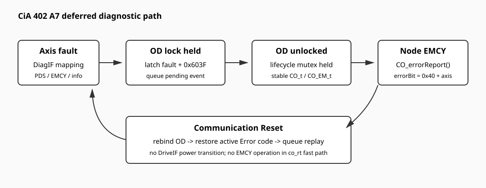

[中文](../zh/cia402.md)

# CiA 402 Device Diagnostics and Product Integration

This page describes the optional per-axis diagnostic path and the boundary between the package demo Object Dictionary and a product-generated CiA 402 Object Dictionary. PDS supervision is documented in [CiA 402 Pure-C Device Core](cia402-device-core.md), and RT-Thread lifecycle integration is documented in [CiA 402 RT-Thread Device Integration](cia402-device-rtt.md).

## Diagnostic model

Each logical device owns an independent fault latch and its standard Error-code object (`0x603F`, `0x683F`, `0x703F`, and so on according to the logical-device offset). The application supplies a `CO_402_device_diag_if_t` mapping so the Device core does not invent a product-specific fault taxonomy.

A mapping keeps the PDS Error-code value, CANopen EMCY code, and manufacturer information separate. With `PKG_CANOPENNODE_CIA402_DEVICE_DIAGNOSTICS` enabled, the Device core:

- captures the first active fault for an axis;
- updates the axis Error-code object;
- queues one diagnostic event for the new fault;
- suppresses duplicate events while the same fault remains latched;
- clears only the affected axis after a successful CiA 402 Fault Reset.

The fault mapping remains application-owned. The package does not assign motor-drive, inverter, sensor, or power-stage error codes on behalf of a product.

## RT-Thread EMCY bridge

`PKG_CANOPENNODE_CIA402_DEVICE_RTT_EMCY_BRIDGE` connects pending axis diagnostics to CANopenNode EMCY handling. The bridge uses the CANopenNode manufacturer-specific error-bit range with `0x40 + logicalDevice` as the axis source, so logical devices 0, 1, and 2 use `0x40`, `0x41`, and `0x42`.

The bridge calls `CO_errorReport()` and `CO_errorReset()` only after the OD lock is released while the lifecycle mutex still protects the active `CO_t`. EMCY handling is therefore kept out of the `co_rt` SYNC/RPDO/TPDO fast path.

A Communication Reset rebinds the generated OD, restores the Error-code object for each active latched fault, and schedules the active diagnostic state for the newly created `CO_EM_t`. It does not replay DriveIF power transitions. CAN bus-off remains a CANopen communication fault and is not converted into an axis fault.

## Demo OD and product OD

`examples/demo_device/` is the package bring-up Object Dictionary. It includes generated CiA 402 objects and optional manufacturer-specific demo objects. It is suitable for package integration and software demonstration, but it is not a product identity definition.

A product firmware should normally:

1. maintain its own XDD/EDS source of truth;
2. generate the product `OD.c` and `OD.h` from that description;
3. keep the package demo OD disabled with `PKG_CANOPENNODE_USING_DEMO_OD=n`;
4. compile the generated product OD from the BSP/application build;
5. define product identity, PDO layout, supported modes, fault taxonomy, and persistent-configuration policy in the product repository.

`examples/cia402_multi_axis_device/` documents the repository's product-oriented multi-axis OD reference layout. Its generated artifact set is expected to come from one consistent device-description revision.

## Product identity and generated artifacts

Keep these version concepts distinct:

- XDD/EDS file version: device-description revision;
- OD `0x1018:03`: product/device revision;
- OD `0x100A`: firmware software version.

A product repository may record generator version, source revision, selected CiA baseline, identity values, and hashes in a manifest. The manifest is metadata for the product-generated files; it does not replace the XDD/EDS as the semantic source of truth.

Do not hand-edit generated `OD.c` or `OD.h` to repair a mismatch with the XDD. Correct the device description and regenerate the outputs instead.

## Integration boundaries

- The package Device core owns PDS supervision and OD binding, not motor-control implementation.
- The RT-Thread adapter owns lifecycle attachment, synchronization, and worker-thread integration, not product fault policy.
- The product owns its generated OD, identity, fault mapping, DriveIF implementation, mode implementation, and application-specific safety policy.
- Manufacturer-specific demo objects are package conveniences and should not become implicit device-discovery requirements.
- CiA 402 conformity or certification is outside the scope of this repository documentation.

## Related documents

- [CiA 402 Pure-C Device Core and OD Binding](cia402-device-core.md)
- [CiA 402 RT-Thread Device Integration](cia402-device-rtt.md)
- [CiA 402 Controller API](cia402-controller.md)
- [Object Dictionary](object-dictionary.md)
- [Configuration guide](configuration.md)
