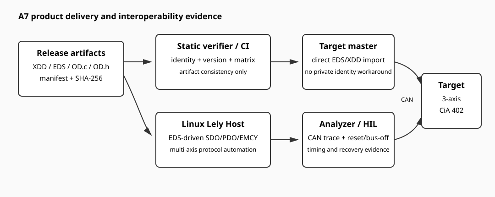

[中文](../zh/cia402.md)

# CiA 402 Device Delivery, Diagnostics, and Interoperability

This page defines the A7 integration contract for turning the multi-axis Device implementation into a deliverable profile. It complements the [Pure-C Device core](cia402-device-core.md) and [RT-Thread lifecycle integration](cia402-device-rtt.md); it does not replace their PDS, mode, or synchronous-path contracts.


## Diagnostic model

Each logical device owns an independent fault latch and its standard Error-code object (`0x603F`, `0x683F`, or `0x703F`). The application supplies a `CO_402_device_diag_if_t` mapping so the core does not invent a product error taxonomy. A mapping contains separate PDS Error-code, CANopen EMCY code, and manufacturer information fields.

With `PKG_CANOPENNODE_CIA402_DEVICE_DIAGNOSTICS` enabled, the Pure-C Device layer captures the first active fault, writes the axis Error-code object, and queues a diagnostic event. Repeated processing of the same latched fault does not generate duplicate events. A successful CiA 402 Fault Reset clears only that axis and queues the corresponding reset event.

The RT-Thread bridge is enabled by `PKG_CANOPENNODE_CIA402_DEVICE_RTT_EMCY_BRIDGE`. Axis source is encoded in the CANopenNode manufacturer-specific error-bit range as `0x40 + logicalDevice`, so axis 0, 1, and 2 use `0x40`, `0x41`, and `0x42`. The bridge calls `CO_errorReport()` or `CO_errorReset()` only after the OD lock is released while the lifecycle mutex still protects the active `CO_t`. It is therefore not inserted into the `co_rt` SYNC/RPDO/TPDO fast path.

A Communication Reset rebinds the generated OD, restores each latched Error-code object, and schedules active diagnostics for replay on the newly created `CO_EM_t`. It does not repeat DriveIF power transitions. CAN bus-off remains a CANopen communication error and must not be reclassified as an axis fault.

## Product description and release artifacts

`examples/demo_device` remains a bring-up/test data model and may contain manufacturer test objects. A product-style integration uses `examples/cia402_multi_axis_device` as the release staging contract and keeps `PKG_CANOPENNODE_USING_DEMO_OD` disabled. The BSP/application compiles the generated `OD.c` and `OD.h` from its selected product XDD.

The release artifact set is one frozen revision:

```text
project.xdd -> OD.c / OD.h / project.eds / project.md
                 + manifest.json
```

`manifest.json` records the XDD description version, CANopenEditor version, source revision, selected normative baseline, `0x1018` identity, and SHA-256 of every generated file. Run:

```sh
python3 .github/ci/canopennode-rtt/verify-cia402-artifacts.py examples/cia402_multi_axis_device
```

The static verifier checks hashes, description version, `0x1018` identity, three-axis release objects, `0x603F/0x683F/0x703F` attributes, and rejects product artifacts containing test-only `0x2300..0x23FF` objects. It does not prove that the generator was reproduced in CI or that a running target uses the same OD.

## Build and test profiles

`demo-cia402-device-rtt-autostart` remains the A6-compatible compile profile with A7 diagnostics disabled. `demo-cia402-a7-validation` enables the per-axis diagnostics module and deferred RT-Thread EMCY bridge in addition to the existing three-axis/mode/SYNC demo configuration. This on/off split is intended to catch source-selection and rollback regressions.

A product-reference build must additionally disable the package demo OD and compile the product-generated OD from the BSP/application. The repository does not fabricate those generated files when product identity, normative baseline, and source revision have not been frozen.

## Interoperability acceptance



The companion Linux Host test repository should load the released EDS and use standard identity/profile data to discover the device. Private manufacturer objects may be used only for deterministic test injection; device recognition, normal SDO/PDO/PDS operation, and master import must not depend on them.

A7 closing evidence covers three-axis SDO and PDO access, independent PDS sequencing, mixed operation modes, one-axis fault/EMCY source checks, NMT reset/rebind behavior, CSP/CSV/CST SYNC operation, bus-off/recovery, and long-run reset/fault stress. Host unit tests and CI static checks are useful evidence, but they do not replace a target-board CAN run, a real master/analyzer import, or HIL timing/recovery evidence.

Do not claim CiA 402 conformity or Device Milestone A completion until the released XDD/EDS matches the running firmware and at least one target master can import and operate the device without a project-private identification workaround.
