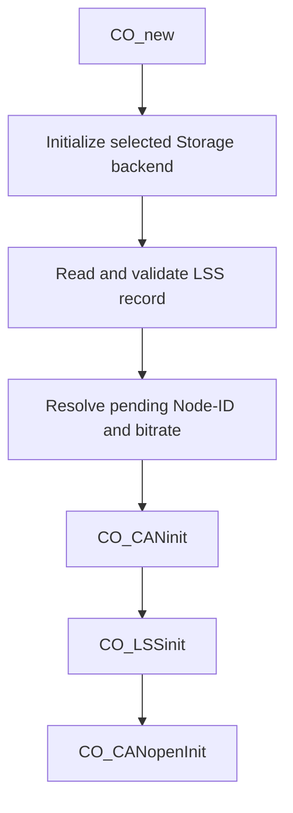

[中文](../zh/lss-persistence.md)

# LSS Node-ID and bitrate persistence

This page describes how the RT-Thread wrapper stores and restores LSS Node-ID and bitrate through the selected Storage backend. The LSS record is a backend-owned auxiliary object and does not reuse the `OD_PERSIST_COMM` payload layout.

## Runtime flow



The first `CO_CANinit()` can therefore use the persisted bitrate. Communication Reset keeps the current in-RAM LSS pending values and does not reload persistence. Reset Node or a real power cycle executes the application startup path and loads the record again.

The feature provides:

- a backend-neutral auxiliary read/write contract in `CO_storage_rtt_backend_ops_t`;
- a single-slot LSS record with format, CRC and commit validation;
- startup loading before the first CAN initialization;
- standard LSS timing-table validation for persisted bitrates;
- fallback to application startup values when the record is absent, invalid, or rejected by CAN initialization.

Enabling this feature alone does not register the LSS Store callback and does not implement runtime bitrate activation.

## Kconfig

At minimum enable Storage, the LSS slave, and LSS persistence:

```text
PKG_CANOPENNODE_USING_LSS_SLAVE=y
PKG_CANOPENNODE_USING_STORAGE=y
PKG_CANOPENNODE_LSS_PERSIST=y
```

`PKG_CANOPENNODE_LSS_PERSIST` is available with every selected RT-Thread Storage backend. It no longer depends on a specific EEPROM backend or on `PKG_CANOPENNODE_STORAGE_PERSIST_COMM`.

Backend behavior:

- DFS stores auxiliary bytes in a backend-owned `*_storage_aux.bin` file.
- The built-in AT24CXX EEPROM backend automatically reserves the final EEPROM page of its configured Storage region as the auxiliary area. Normal CANopen Storage allocations use the remaining leading bytes. No separate LSS EEPROM offset is configured.
- A user-provided backend must implement `aux_read` and `aux_write` in `CO_storage_rtt_backend_ops_t`. Offsets passed to these callbacks are relative to the backend-owned auxiliary area.

For the AT24CXX backend, `PKG_CANOPENNODE_STORAGE_AT24C_OFFSET` and `PKG_CANOPENNODE_STORAGE_AT24C_REGION_SIZE` still define the complete package-owned region. When LSS persistence is enabled, that region must be larger than one EEPROM page because the last page is reserved for auxiliary persistence.

## Single-slot record format

The current record occupies 16 bytes:

| Offset | Size | Field | Meaning |
|---:|---:|---|---|
| 0 | 4 | magic | ASCII `LSS1` |
| 4 | 1 | version | Current value `1` |
| 5 | 1 | flags | Current value `0` |
| 6 | 2 | length | Encoded record size |
| 8 | 1 | nodeId | `1..127` or `0xFF` |
| 9 | 1 | reserved | Must be `0` |
| 10 | 2 | bitrate | kbit/s |
| 12 | 2 | crc16 | CRC16-CCITT over bytes before the CRC field |
| 14 | 2 | commit | Valid value `0xA55A` |

The implementation defines this layout with a byte-oriented C structure. Record size and field boundaries used by CRC and commit operations are derived with `sizeof()` and `offsetof()` instead of duplicated numeric offset macros. Multi-byte values remain encoded with CANopenNode byte helpers so the on-media format is independent of target endianness.

## Write and interruption behavior

The single-slot write sequence is:

```text
write invalid commit
 -> write body + CRC
 -> read back body
 -> write valid commit
 -> read back full record
 -> validate complete record
```

An interrupted write is not accepted as valid on the next startup. The single-slot design does not retain the previous version; an invalid record causes startup to use the application-provided Node-ID and bitrate.

## Reset semantics

- Initial application startup: initialize Storage, load the LSS record, then execute the first `CO_CANinit()`.
- Communication Reset: recreate `CO_t` and rebind Storage without reloading the LSS record.
- Reset Node / power cycle: execute application initialization again and reload the record.

This follows the CANopenNode LSS pending-value lifecycle: persistent values are initialized on program startup and must not overwrite pending values during Communication Reset.

## Recovery behavior

A syntactically valid standard LSS bitrate can still be rejected by a specific RT-Thread CAN device. When the first CAN initialization fails after loading a persistent LSS record, the wrapper restores the original application startup Node-ID and bitrate and retries CAN initialization once. This keeps a portable or stale persistence record from permanently preventing the node from starting.

Invalid format, CRC, commit marker, Node-ID, bitrate, missing auxiliary data, or backend I/O errors never replace the application startup values. Target hardware must still validate real reset, power-cycle, and media-failure behavior.
