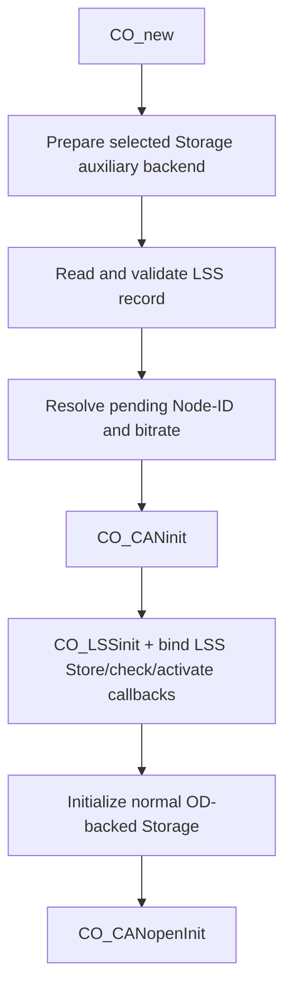

[中文](../zh/lss-persistence.md)

# LSS Node-ID and bitrate persistence

This page describes how the RT-Thread wrapper stores and restores LSS Node-ID and bitrate through the selected Storage backend. The LSS record is a backend-owned auxiliary object and does not reuse the `OD_PERSIST_COMM` payload layout.

## Runtime flow



The first `CO_CANinit()` can therefore use the persisted bitrate without invoking the normal Storage backend `init` callback before CAN initialization. Communication Reset keeps the current in-RAM LSS pending values and does not reload persistence. Reset Node or a real power cycle executes the application startup path and loads the record again.

The feature provides:

- a backend-neutral auxiliary `aux_init`/read/write contract in `CO_storage_rtt_backend_ops_t`;
- a single-slot LSS record with format, CRC and commit validation;
- a single-slot write primitive that invalidates the old commit before updating the body and writes the valid commit last;
- full committed-record readback, decode, CRC, Node-ID, and bitrate verification before Store success is reported;
- startup loading before the first CAN initialization;
- registration of `CO_LSSslave_initCfgStoreCall()` with the RT-Thread single-slot persistence callback;
- `CO_LSSslave_initCkBitRateCall()` validation for standard LSS bitrates;
- `CO_LSSslave_initActBitRateCall()` with a non-blocking PRE_DELAY -> SWITCH -> POST_DELAY runtime state machine;
- an atomic `CO_CANmodule_t::txEnabled` gate checked by `CO_CANsend()` to suppress new CANopen transmissions during both delay windows;
- `CO_RTT_CANsetBitrate()` for live RT-Thread CAN bitrate reconfiguration while reusing the normal-mode restore path;
- standard LSS timing-table validation for persisted bitrates;
- fallback to application startup values when the record is absent, invalid, or a different persisted bitrate is rejected by CAN initialization.

The wrapper handles LSS `Store configuration (0x17)`, `Configure Bit Timing (0x13)`, and `Activate Bit Timing (0x15)`. Runtime switching uses RT-Thread `RT_CAN_CMD_SET_BAUD`. The current STM32F407 bxCAN target supports the standard 10/20/50/125/250/500/800/1000 kbit/s LSS rates through the RT-Thread STM32 CAN baud table.

## Kconfig

At minimum enable Storage, the LSS slave, and LSS persistence:

```text
PKG_CANOPENNODE_USING_LSS_SLAVE=y
PKG_CANOPENNODE_USING_STORAGE=y
PKG_CANOPENNODE_LSS_PERSIST=y
```

`PKG_CANOPENNODE_LSS_PERSIST` is available with every selected RT-Thread Storage backend. It no longer depends on a specific EEPROM backend or on `PKG_CANOPENNODE_STORAGE_PERSIST_COMM`.

Backend behavior:

- DFS stores auxiliary bytes in a backend-owned `*_storage_aux.bin` file and uses a separate auxiliary initialization path to bind the instance before the first CAN initialization.
- The generic EEPROM Storage backend obtains its media access from an EEPROM device provider. The built-in AT24CXX provider automatically reserves the final EEPROM page of its configured Storage region as the auxiliary area. Normal CANopen Storage allocations use the remaining leading bytes. No separate LSS EEPROM offset is configured.
- A custom EEPROM provider can replace the weak built-in provider hooks and must provide `co_storage_rtt_eeprom_module_get()` plus the `CO_eeprom_*` target hooks. When LSS persistence is enabled, it must also provide `co_storage_rtt_eeprom_provider_aux_init()`, `co_storage_rtt_eeprom_aux_read()` and `co_storage_rtt_eeprom_aux_write()`.
- A user-provided Storage backend must implement `aux_init`, `aux_read` and `aux_write` in `CO_storage_rtt_backend_ops_t`. `aux_init` is the dedicated pre-CAN preparation hook and is separate from the normal OD-backed Storage `init` callback.

For the AT24CXX backend, `PKG_CANOPENNODE_STORAGE_AT24C_OFFSET` and `PKG_CANOPENNODE_STORAGE_AT24C_REGION_SIZE` still define the complete package-owned region. When LSS persistence is enabled, that region must be larger than one EEPROM page because the last page is reserved for auxiliary persistence.

## Single-slot record format

The current record occupies 16 bytes:

| Offset | Size | Field | Meaning |
|---:|---:|---|---|
| 0 | 4 | magic | ASCII `LSS1` |
| 4 | 1 | version | Current value `1` |
| 5 | 1 | flags | Current value `0` |
| 6 | 2 | length | Encoded record size |
| 8 | 1 | nodeId | `1..127` or `0xFF` |
| 9 | 1 | reserved | Must be `0` |
| 10 | 2 | bitrate | kbit/s |
| 12 | 2 | crc16 | CRC16-CCITT over bytes before the CRC field |
| 14 | 2 | commit | Valid value `0xA55A` |

The implementation defines this layout with a byte-oriented C structure. Record size and field boundaries used by CRC and commit operations are derived with `sizeof()` and `offsetof()` instead of duplicated numeric offset macros. Multi-byte values remain encoded with CANopenNode byte helpers so the on-media format is independent of target endianness.

## LSS callback binding

After `CO_LSSinit()` succeeds, `co_app_rtt_lss_init()` explicitly registers all three callbacks:

```c
CO_LSSslave_initCfgStoreCall(app->canOpenStack->LSSslave,
                             app,
                             co_app_rtt_lss_store_config);
CO_LSSslave_initCkBitRateCall(app->canOpenStack->LSSslave,
                              app,
                              co_app_rtt_lss_check_bitrate);
CO_LSSslave_initActBitRateCall(app->canOpenStack->LSSslave,
                               app,
                               co_app_rtt_lss_activate_bitrate);
```

When CANopenNode receives LSS command `0x17`, it synchronously passes the pending Node-ID and bitrate to the Store callback. The callback calls `co_lss_persist_rtt_store()`. It returns `true` only after the single-slot record has been committed and the complete record has been read back and validated, so CANopenNode does not report Store success before media verification finishes.

The bitrate check and activate callbacks are bound directly at the same initialization point. No macro aliasing or `rt_device_write()` interception is used. Communication Reset deletes and recreates `CO_t`, including the LSS slave object, so `co_app_rtt_lss_init()` re-registers all three callbacks on the new object.

## Runtime bitrate activation

Configure Bit Timing accepts the standard CANopen LSS rates 10/20/50/125/250/500/800/1000 kbit/s. On the current STM32F407 target, all of them also exist in the RT-Thread bxCAN baud table; the actual switch still treats `RT_CAN_CMD_SET_BAUD` as the final hardware result.

The Activate Bit Timing callback is non-blocking: it does not sleep and does not reconfigure hardware directly. It records the previous/target bitrate and delay, atomically closes the `CO_CANsend()` software TX gate, and enters PRE_DELAY immediately. Mainline processing then advances:

```text
IDLE
 -> PRE_DELAY
 -> SWITCH
 -> POST_DELAY
 -> IDLE
```

Behavior:

1. The callback calls `CO_RTT_CANsetTxEnabled(CANmodule, false)`. New CANopen sends entering `CO_CANsend()` are intentionally suppressed and return `CO_ERROR_NO`, so protocol-mandated silence is not reported as TX overflow or a system error.
2. Mainline and realtime processing may continue during PRE_DELAY; any new CANopen TX that reaches `CO_CANsend()` is gated.
3. At the switch point mainline takes `lifecycleMutex` to exclude the realtime worker, then calls `CO_RTT_CANsetBitrate()`. The helper executes `RT_CAN_CMD_SET_BAUD` and reuses `CO_CANsetNormalMode()` to restore filter/RX/start sequencing.
4. During POST_DELAY the controller may already be `CANnormal=true`, while `txEnabled` remains false so new CANopen TX is still suppressed.
5. When POST_DELAY expires, `CO_RTT_CANsetTxEnabled(..., true)` restores normal CANopen transmission.
6. On success `app->baudrate` becomes the active bitrate while `lssPendingBitrate` remains the LSS-configured value for a later Store command.

If the target bitrate switch fails, the wrapper attempts to restore the previous bitrate. A successful rollback resumes communication and restores the in-RAM pending bitrate. If rollback also fails, `txEnabled` stays false and `CANnormal` stays false so new CANopen transmission cannot continue from an unknown controller/bitrate state; Reset Node, power cycle, or a bitrate rescue procedure is then required.

The current silence boundary is deliberately at the CANopen software layer. Clearing `txEnabled` prevents new `CO_CANsend()` calls that have not yet entered the RT-Thread/HAL TX path. A frame that already entered `rt_device_write()` or a hardware mailbox before the gate was closed is not aborted by the current implementation. A future target-driver API based on `HAL_CAN_AbortTxRequest()` can clear pending hardware TX before PRE_DELAY without changing the main LSS state-machine design. Applications must also avoid bypassing CANopenNode and writing directly to the same CAN device during an LSS activation window.

## Write and interruption behavior

The single-slot write sequence is:

```text
write invalid commit
 -> write body + CRC
 -> read back and compare body
 -> write valid commit
 -> read back the complete record
 -> validate magic/version/length/reserved/CRC/commit/Node-ID/bitrate
 -> return success
```

If the valid-commit write itself reports failure, the implementation makes a best-effort write of the invalid marker before returning failure. If the valid commit was written but the final full-record readback or decode/compare fails, it also makes a best-effort attempt to invalidate the slot and returns failure to the LSS master.

The final invalidate is deliberately best-effort. If media rejects the invalidation write as well, the function still reports Store failure while a previously committed valid record may remain on media. A single-slot read/write contract cannot eliminate this edge case; products that require rollback semantics need a dual-slot or stronger atomic backend.

An interrupted write is not accepted as valid on the next startup. The single-slot design does not retain the previous version. If power is lost after the old commit has been invalidated and before the new valid commit is complete, startup can fall back to the application-provided Node-ID and bitrate.

## Reset semantics

- Initial application startup: prepare the Storage auxiliary path, load the LSS record, execute the first `CO_CANinit()`, initialize LSS and bind Store/check/activate callbacks, then run normal OD-backed Storage initialization.
- Communication Reset: recreate `CO_t`, keep the already configured pending Node-ID/bitrate in RAM, do not reload the LSS record, bind Store/check/activate callbacks to the new LSS slave object again, and initialize the new CAN module with `txEnabled=true`.
- Reset Node / power cycle: execute application initialization again and reload the record.

This follows the CANopenNode LSS pending-value lifecycle: persistent values are initialized on program startup and must not overwrite pending values during Communication Reset.

## Recovery behavior

Invalid format, CRC, commit marker, Node-ID, bitrate, missing auxiliary data, or backend I/O errors never replace the application startup values.

During Store, a body readback failure, commit write failure, final full-record readback failure, or final decode/compare failure causes the callback to return `false`, which maps to LSS Store failed.

A syntactically valid standard LSS bitrate can still be rejected by a specific RT-Thread CAN device. When the first CAN initialization fails after loading a persistent LSS record, the wrapper retries with the application startup values only if the persisted bitrate differs from the startup bitrate. `CO_CANinit()` is bitrate-dependent, so retrying when both bitrates are identical would only repeat the same CAN initialization.

A runtime switch failure first attempts to restore the previous bitrate. If rollback also fails, the wrapper keeps new CANopen transmission disabled instead of continuing from an unknown bitrate/controller state.

