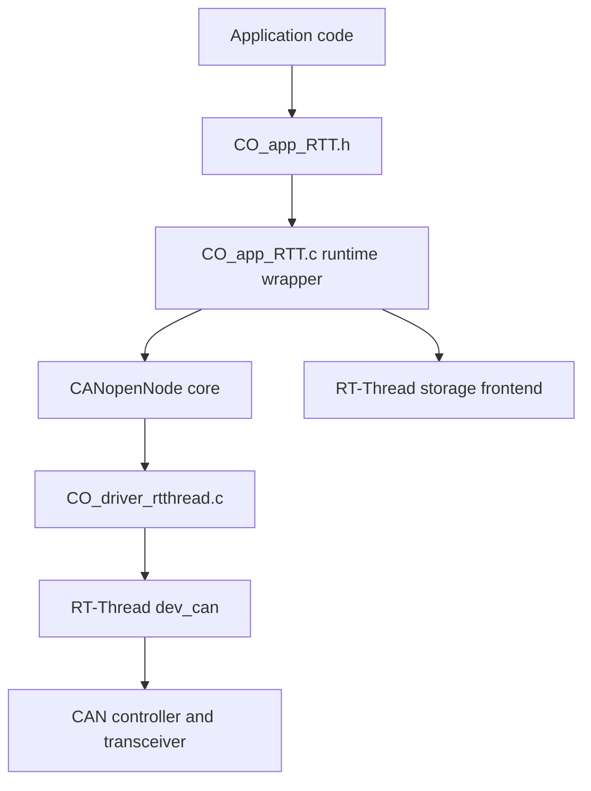
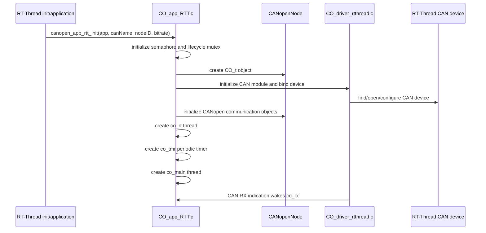
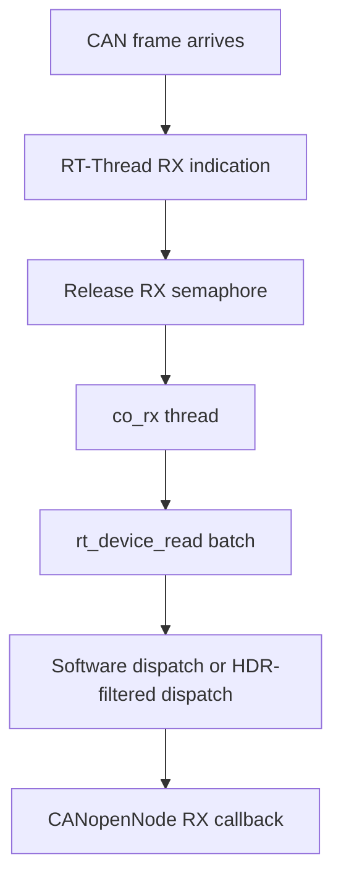

[中文](../zh/rt-thread-integration.md)

# RT-Thread integration

This document explains how the RT-Thread port binds CANopenNode to RT-Thread devices, threads, timers, and synchronization primitives.

## 1. Layering



The port has two main responsibilities:

1. `CO_driver_rtthread.c` implements the CANopenNode target driver hooks on top of RT-Thread `dev_can`.
2. `CO_app_RTT.c` owns the application runtime instance, creates CANopenNode objects, starts worker threads, handles communication reset, and optionally initializes storage and LED outputs.

## 2. Runtime instance

The application-facing object is `CANopenNodeRTT` from `CO_app_RTT.h`.

Key fields are:

| Field | Meaning |
|---|---|
| `canName` | RT-Thread CAN device name stored by reference. |
| `desiredNodeID` | Requested CANopen Node-ID. |
| `activeNodeID` | Node-ID active after CANopen communication initialization. |
| `baudrate` | CAN bitrate in kbit/s. |
| `canOpenStack` | Owned `CO_t` object created by CANopenNode. |
| `mainThread` | Mainline CANopen worker thread. |
| `rtThread` | Realtime CANopen worker thread. |
| `rtTimer` | Periodic RT-Thread timer that wakes realtime processing. |
| `rtSem` | Realtime wake semaphore. |
| `lifecycleMutex` | Protects stack deletion/recreation during communication reset. |

Manual initialization uses:

```c
rt_err_t canopen_app_rtt_init(CANopenNodeRTT *app,
                              const char *canName,
                              uint8_t nodeID,
                              uint16_t bitrate);
```

The instance must be zero-initialized before first use. `canName` is not copied, so the string storage must remain valid while the instance exists.

## 3. Startup sequence



The mainline thread is started last because it can process `CO_RESET_COMM` and recreate the CANopen stack. Realtime synchronization objects must already be constructed before that path runs.

## 4. Threads and timer

| Runtime object | Default name | Responsibility |
|---|---|---|
| RX helper thread | `co_rx` | Read frames from RT-Thread CAN device and dispatch CANopenNode receive callbacks. |
| Mainline thread | `co_main` | Run `CO_process()`, handle NMT, SDO, heartbeat, storage auto processing, LED state, and reset commands. |
| Realtime thread | `co_rt` | Run time-sensitive SYNC, SRDO, RPDO, and TPDO paths when enabled. |
| Realtime timer | `co_tmr` | Periodically release `rtSem` to wake `co_rt`. |

The requested realtime period is configured by `PKG_CANOPENNODE_TIMER_PERIOD_US`. The wrapper rounds the period to RT-Thread ticks, so very small values are limited by the BSP tick rate.

## 5. CAN receive path



The RX helper reads up to `PKG_CANOPENNODE_RX_BATCH_SIZE` frames per loop. Larger batches reduce wake/read overhead but increase stack use in the RX thread.

When `RT_CAN_USING_HDR` and `PKG_CANOPENNODE_USING_RTT_CAN_FILTER` are enabled, the driver tries to configure RT-Thread CAN HDR filters. If hardware filter setup is not possible, the driver falls back to software dispatch.

## 6. CAN transmit path

CANopenNode transmit buffers are backed by `CO_CANtx_t`, which stores the standard CAN identifier, DLC, payload, `bufferFull`, and synchronous PDO flag. The driver submits frames through the RT-Thread CAN device and maps RT-Thread write results into CANopenNode return codes.

Application code that accesses CANopenNode send state directly must respect the CANopenNode locking macros:

```c
CO_LOCK_CAN_SEND(CANmodule);
/* Access transmit-buffer state. */
CO_UNLOCK_CAN_SEND(CANmodule);
```

Do not call CANopenNode APIs that may lock RT-Thread mutexes from ISR context. Defer ISR work to a thread.

## 7. OD, EMCY, and locking boundaries

The RT-Thread target layer provides these locking macros:

| Macro | Protected area |
|---|---|
| `CO_LOCK_CAN_SEND` / `CO_UNLOCK_CAN_SEND` | CANopenNode transmit buffer state. |
| `CO_LOCK_EMCY` / `CO_UNLOCK_EMCY` | Emergency object state. |
| `CO_LOCK_OD` / `CO_UNLOCK_OD` | PDO-mappable Object Dictionary access. |

Use these locks when application code shares OD, EMCY, or CAN send state with CANopenNode processing threads.

## 8. Communication reset

The mainline thread watches the return value from `CO_process()`. When CANopenNode requests communication reset, the wrapper stops realtime processing, protects stack lifetime with `lifecycleMutex`, disables the CAN module, deletes the current CANopen stack object, recreates it, and restarts communication.

This design keeps realtime processing from dereferencing `app->canOpenStack` while it is being deleted and recreated.

## 9. Storage integration

When `PKG_CANOPENNODE_USING_STORAGE` is enabled, the runtime wrapper owns one `CO_storage_t` and an entry table for each `CANopenNodeRTT` instance. The selected backend is compiled from `port/rtthread/storage/` and is selected by Kconfig.

Available backend choices are:

| Backend | Intended use |
|---|---|
| DFS | File-based persistence through RT-Thread DFS. |
| EEPROM | AT24CXX-backed EEPROM persistence for one instance. |
| User | Board/application-specific flash, filesystem, NVM, or fail-safe storage. |

## 10. Integration rules

- Keep the CAN device name stable for the lifetime of the instance.
- Keep realtime thread priority higher than the mainline thread when PDO/SYNC/SRDO timing matters.
- Do not enable auto init and manual init for the same logical node.
- Do not call CANopenNode lock-taking APIs from ISR context.
- Replace the demo OD before production firmware release.
- Treat `CO_RESET_COMM` as a normal CANopen lifecycle event; application-owned references into the old `CO_t` object must not outlive reset.
