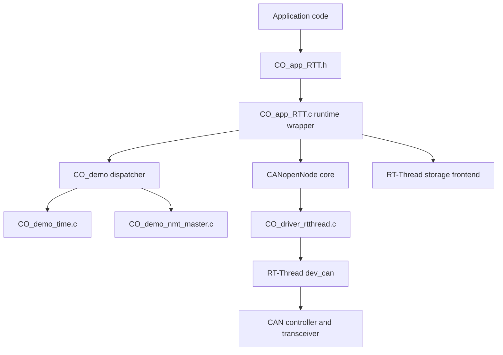
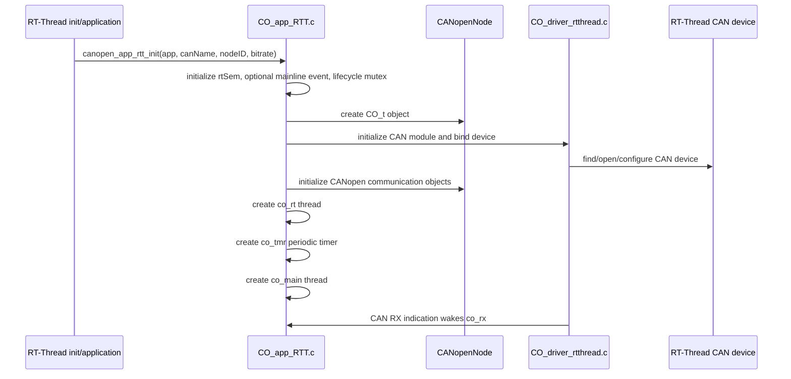
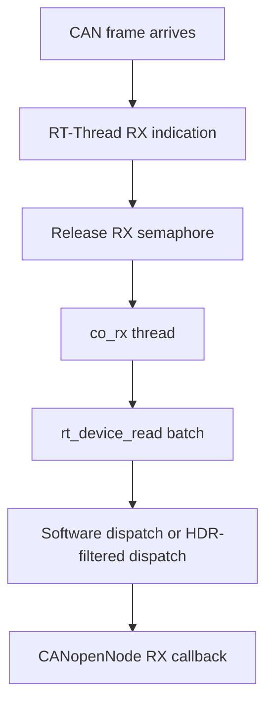

[中文](../zh/rt-thread-integration.md)

# RT-Thread integration

This document explains how the RT-Thread port binds CANopenNode to RT-Thread devices, threads, timers, and synchronization primitives.

## 1. Layering


```mermaid
flowchart TD
    UserApp[Application code] --> AppAPI[CO_app_RTT.h]
    AppAPI --> Runtime[CO_app_RTT.c runtime wrapper]
    Runtime --> Demo[CO_demo dispatcher]
    Demo --> DemoTime[CO_demo_time.c]
    Demo --> DemoNmt[CO_demo_nmt_master.c]
    Runtime --> CANopen[CANopenNode core]
    Runtime --> Storage[RT-Thread storage frontend]
    CANopen --> Target[CO_driver_rtthread.c]
    Target --> DevCAN[RT-Thread dev_can]
    DevCAN --> Controller[CAN controller and transceiver]
```

The port has two main responsibilities:

1. `CO_driver_rtthread.c` implements the CANopenNode target driver hooks on top of RT-Thread `dev_can`.
2. `CO_app_RTT.c` owns the application runtime instance, creates CANopenNode objects, starts worker threads, handles communication reset, and optionally initializes storage and LED outputs.
3. `port/rtthread/demo/` owns demo/test feature implementations; the runtime wrapper only invokes the fixed `CO_demo_init()`, `CO_demo_bind()`, `CO_demo_process()`, `CO_demo_reset()`, and init-rollback `CO_demo_deinit()` hooks.

## 2. Runtime instance

The application-facing object is `CANopenNodeRTT` from `CO_app_RTT.h`.

Key fields are:

| Field | Meaning |
|---|---|
| `canName` | RT-Thread CAN device name stored by reference. |
| `desiredNodeID` | Requested CANopen Node-ID. |
| `activeNodeID` | Node-ID active after CANopen communication initialization. |
| `baudrate` | CAN bitrate in kbit/s. |
| `canOpenStack` | Owned `CO_t` object created by CANopenNode. |
| `demo` | Optional demo/test dispatcher state; feature state is owned by `CO_demo_*` modules. |
| `mainThread` | Mainline CANopen worker thread. |
| `rtThread` | Realtime CANopen worker thread. |
| `rtTimer` | Periodic RT-Thread timer that wakes realtime processing. |
| `rtSem` | Realtime wake semaphore. |
| `lifecycle` | Configurable fixed-capacity `ops + context + optional release` registry; the dispatcher does not know profile types. |
| `mainline` | Event-driven mainline scheduler state when `PKG_CANOPENNODE_GLOBAL_TIMERNEXT` is enabled. |
| `lifecycleMutex` | Protects stack deletion/recreation during communication reset. |

Manual initialization uses:

```c
rt_err_t canopen_app_rtt_init(CANopenNodeRTT *app,
                              const char *canName,
                              uint8_t nodeID,
                              uint16_t bitrate);
```

The instance must be zero-initialized before first use. `canName` is not copied, so the string storage must remain valid while the instance exists.

## 3. Startup sequence


```mermaid
sequenceDiagram
    participant App as RT-Thread init/application
    participant Wrapper as CO_app_RTT.c
    participant Core as CANopenNode
    participant Driver as CO_driver_rtthread.c
    participant CAN as RT-Thread CAN device

    App->>Wrapper: canopen_app_rtt_init(app, canName, nodeID, bitrate)
    Wrapper->>Wrapper: initialize rtSem, optional mainline event, lifecycle mutex
    Wrapper->>Core: create CO_t object
    Wrapper->>Driver: initialize CAN module and bind device
    Driver->>CAN: find/open/configure CAN device
    Wrapper->>Core: initialize CANopen communication objects
    Wrapper->>Wrapper: create co_rt thread
    Wrapper->>Wrapper: create co_tmr periodic timer
    Wrapper->>Wrapper: create co_main thread
    Driver->>Wrapper: CAN RX indication wakes co_rx
```

The mainline thread is started last because it can process `CO_RESET_COMM` and recreate the CANopen stack. Realtime synchronization objects must already be constructed before that path runs.

When lifecycle autostart is selected, profile factories are registered during RT-Thread component initialization. The single default app `INIT_APP_EXPORT` entry then calls `CO_RTT_lifecycleAutoAttachAll()` before `canopen_app_rtt_init()`. Auto factories only create/register owned contexts; the existing `CO_RTT_lifecycleRuntimeInit()` and `CO_RTT_lifecycleRuntimeStart()` remain the only generic resource-creation/start dispatcher. Factory failure rolls back newly added auto slots without touching an earlier manual prefix.

### Demo/test extension boundary

`CO_app_RTT.c` does not implement specific TIME diagnostic, EMCY Consumer diagnostic, or NMT Master test behavior. After communication objects are initialized it calls `CO_demo_bind()` to rebind callbacks, invokes `CO_demo_process()` after each `CO_process()`, calls `CO_demo_reset()` before local communication/application reset, and calls `CO_demo_deinit()` only after CAN RX is stopped during initialization rollback. SConscript adds the demo dispatcher only when the demo OD is enabled and at least one demo/test module is selected, then selects each optional implementation from its own Kconfig option. When no demo/test module is selected, the dispatcher state and hook calls are compiled out instead of using dummy no-op state. New demo/test modules therefore extend `port/rtthread/demo/`, Kconfig, and SConscript selection without adding feature logic to the main runtime wrapper.

## 4. Threads and timer

| Runtime object | Default name | Responsibility |
|---|---|---|
| RX helper thread | `co_rx` | Read frames from RT-Thread CAN device and dispatch CANopenNode receive callbacks. |
| Mainline thread | `co_main` | Run `CO_process()`, handle NMT, SDO, heartbeat, storage auto processing, LED state, and reset commands. |
| Realtime thread | `co_rt` | Run time-sensitive SYNC, SRDO, RPDO, and TPDO paths when enabled. |
| Realtime timer | `co_tmr` | Releases `rtSem` first, then invokes the generic lifecycle realtime hook; the CiA 402 hook releases `cia402Sem`. |
| CiA 402 thread | `co_402` | Runs one Pure-C PDS supervisor pass for an attached A4 Device; default priority 5. |
| Mainline event | `co_evt` | Coalesce callback-pre and runtime wake notifications when `PKG_CANOPENNODE_GLOBAL_TIMERNEXT` is enabled. |

The requested realtime period is configured by `PKG_CANOPENNODE_TIMER_PERIOD_US`. The wrapper rounds the period to RT-Thread ticks, so very small values are limited by the BSP tick rate.

With `PKG_CANOPENNODE_GLOBAL_TIMERNEXT=n`, `co_main` keeps the legacy 1 ms polling loop and `CO_mainline_RTT.c` is not selected by SCons. With it enabled, `CO_mainline_RTT.c` owns the event lifecycle, callback-pre wake hooks, wait policy, and wrapper-owned deadline aggregation; `CO_app_RTT.c` only calls the scheduler at explicit feature-guarded integration points. `CO_process()` and wrapper-owned work contribute the next deadline, while callback-pre hooks and Gateway input set the mainline event to wake the thread early. Event bits are only scheduling hints; CANopenNode remains the owner of protocol state and receive buffers. With 402 disabled, the lifecycle registry is not selected and the realtime path remains exactly `co_tmr -> rtSem -> co_rt`. An attached A4 Device uses the same timer through the generic realtime hook; the CiA 402 hook wakes `cia402Sem -> co_402`. This is independent of timerNext and does not insert PDS work into the co_rt SYNC/RPDO/TPDO/SRDO sequence.

## 5. CAN receive path


```mermaid
flowchart TD
    Frame[CAN frame arrives] --> Indicate[RT-Thread RX indication]
    Indicate --> Sem[Release RX semaphore]
    Sem --> RxThread[co_rx thread]
    RxThread --> Read[rt_device_read batch]
    Read --> Dispatch[Software dispatch or HDR-filtered dispatch]
    Dispatch --> Callback[CANopenNode RX callback]
```

The RX helper reads up to `PKG_CANOPENNODE_RX_BATCH_SIZE` frames per loop. Larger batches reduce wake/read overhead but increase stack use in the RX thread.

When `RT_CAN_USING_HDR` and `PKG_CANOPENNODE_USING_RTT_CAN_FILTER` are enabled, the driver tries to configure RT-Thread CAN HDR filters. If hardware filter setup is not possible, the driver falls back to software dispatch.

## 6. CAN transmit path

CANopenNode transmit buffers are backed by `CO_CANtx_t`, which stores the standard CAN identifier, DLC, payload, `bufferFull`, and synchronous PDO flag. The driver submits frames through the RT-Thread CAN device and maps RT-Thread write results into CANopenNode return codes.

Application code that accesses CANopenNode send state directly must respect the CANopenNode locking macros:

```c
CO_LOCK_CAN_SEND(CANmodule);
/* Access transmit-buffer state. */
CO_UNLOCK_CAN_SEND(CANmodule);
```

Do not call CANopenNode APIs that may lock RT-Thread mutexes from ISR context. Defer ISR work to a thread.

## 7. OD, EMCY, and locking boundaries

The RT-Thread target layer provides these locking macros:

| Macro | Protected area |
|---|---|
| `CO_LOCK_CAN_SEND` / `CO_UNLOCK_CAN_SEND` | CANopenNode transmit buffer state. |
| `CO_LOCK_EMCY` / `CO_UNLOCK_EMCY` | Emergency object state. |
| `CO_LOCK_OD` / `CO_UNLOCK_OD` | PDO-mappable Object Dictionary access. |

Use these locks when application code shares OD, EMCY, or CAN send state with CANopenNode processing threads.

## 8. Communication reset

The mainline thread watches the return value from `CO_process()`. On communication reset, the wrapper stops `rtTimer`, drains `rtSem`, and calls generic `CO_RTT_lifecycleResetWakeups()`. After taking `lifecycleMutex`, the registry runs communication-stop hooks in reverse registration order; the old CAN module is then disabled and its RX thread drained before communication-quiesced hooks release old-generation bindings. After the old stack is deleted, bind hooks run in registration order after `CO_CANopenInit()` and before SRDO/PDO initialization, followed by ready hooks after CAN normal mode. Auto-owned contexts are not released during this reset; final teardown runs `runtimeDeinit()` first and then the slot release callback. CiA 402 is one extension; `CO_app_RTT.c` no longer contains profile-specific calls.

Both `co_rt` and `co_402` use `lifecycleMutex -> OD lock` and resolve `app->canOpenStack` only after taking the lifecycle mutex. A thread therefore cannot retain an old `CO_t`, `CANmodule`, or `odMutex` pointer across reset. See [CiA 402 RT-Thread Device Thread](cia402-device-rtt.md) for the complete A4 sequence.

## 9. Storage integration

When `PKG_CANOPENNODE_USING_STORAGE` is enabled, the runtime wrapper owns one `CO_storage_t` and an entry table for each `CANopenNodeRTT` instance. The selected backend is compiled from `port/rtthread/storage/` and is selected by Kconfig.

Available backend choices are:

| Backend | Intended use |
|---|---|
| DFS | File-based persistence through RT-Thread DFS. |
| EEPROM | AT24CXX-backed EEPROM persistence for one instance. |
| User | Board/application-specific flash, filesystem, NVM, or fail-safe storage. |

## 10. Integration rules

- Keep the CAN device name stable for the lifetime of the instance.
- Keep realtime thread priority higher than the mainline thread when PDO/SYNC/SRDO timing matters.
- Do not enable auto init and manual init for the same logical node.
- Do not call CANopenNode lock-taking APIs from ISR context.
- Replace the demo OD before production firmware release.
- Treat `CO_RESET_COMM` as a normal CANopen lifecycle event; application-owned references into the old `CO_t` object must not outlive reset.
