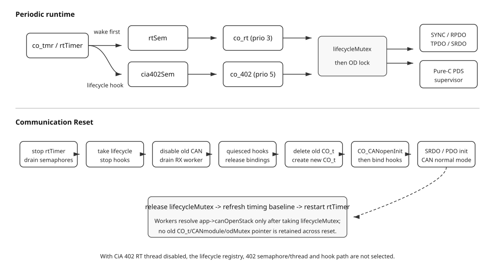

[English](../en/cia402-device-rtt.md)

# CiA 402 RT-Thread Device Thread 与 Communication Reset

本文说明阶段 A4 如何把 A3 的 Pure-C `CO_402_device_manager_t` 接入 `CANopenNodeRTT`。A4 不改变 PDS FSA、
DriveIF 或生成 OD 的语义，只负责 RT-Thread thread、通用 lifecycle extension 接入、锁顺序、通信初始化顺序和 Communication Reset 生命周期。



## 1. 启用与 attach

相关 Kconfig：

| 选项 | 默认值 | 作用 |
|---|---:|---|
| `PKG_CANOPENNODE_CIA402` | `n` | CiA 402 总开关。关闭时 A4 不增加 `CANopenNodeRTT` 字段或 RT 资源。 |
| `PKG_CANOPENNODE_CIA402_DEVICE` | `y` | A3 Pure-C Device core。 |
| `PKG_CANOPENNODE_CIA402_DEVICE_RTT_THREAD` | `y` | 编译 A4 RT adapter；选择通用 lifecycle registry，只有成功 attach 的实例才创建 thread/semaphore。 |
| `PKG_CANOPENNODE_CIA402_DEVICE_RTT_AUTOSTART` | `n` | 配合默认 app auto init 与 RT-Thread component init，由已注册的 CiA 402 factory 自动分配 runtime/axis state 并 attach。 |
| `PKG_CANOPENNODE_CIA402_DEVICE_RTT_DEMO` | `n` | 注册 package 自带的软件 DriveIF factory，并选择生成的 demo OD，用于协议/PDS/lifecycle 验证。 |
| `PKG_CANOPENNODE_CIA402_DEMO_AXIS_COUNT` | `3` | 软件 demo logical device 数量；按生成 OD 的范围明确限制为 1..3。 |
| `PKG_CANOPENNODE_CIA402_THREAD_STACK_SIZE` | `2048` | `co_402` 栈大小。 |
| `PKG_CANOPENNODE_CIA402_THREAD_PRIORITY` | `5` | `co_402` 优先级；必须低于 `co_rt`，即数值必须大于 realtime priority。 |

Device 产品使用 manual init，在 `canopen_app_rtt_init()` 前 attach persistent storage：

```c
static CANopenNodeRTT app;
static CO_402_device_axis_t axes[3];
static CO_402_device_RTT_t cia402;
static const CO_402_device_axis_config_t axisConfigs[3] = {
    { .logicalDevice = 0U, .drive = &driveIf0, .driveObject = &motor0 },
    { .logicalDevice = 1U, .drive = &driveIf1, .driveObject = &motor1 },
    { .logicalDevice = 2U, .drive = &driveIf2, .driveObject = &motor2 },
};

static const CO_402_device_RTT_config_t cia402Config = {
    .axes = axes,
    .configs = axisConfigs,
    .axisCount = 3U,
};

CO_402_device_RTT_attach(&app, &cia402, &cia402Config);
canopen_app_rtt_init(&app, "can1", 1U, 1000U);
```

`attach()` 初始化 caller-owned `CO_402_device_RTT_t`，保存 axis/config pointer，并向 `CO_RTT_lifecycle` 固定容量 registry 注册静态 ops/context；`CO_app_RTT.h` 不再包含 CiA402 header，也不再内嵌任何 CiA402 runtime state。attach 不创建 thread/semaphore、不访问 CAN、不绑定 OD。
`app` 与 `cia402` runtime 都必须首次使用前清零，且 runtime/axis/config/DriveIF/`driveObject` storage 都必须覆盖实例生命周期。attach API 显式接收 runtime：`CO_402_device_RTT_attach(app, runtime, config)`，从而保持通用 app/lifecycle 层对 profile 类型无感知。对同一逻辑节点使用 manual path 时，应关闭默认 app auto init。

### 可选自动构造

`PKG_CANOPENNODE_CIA402_DEVICE_RTT_AUTOSTART=y` 只改变对象构造与 ownership，并要求默认 app、RT-Thread component init 和 heap 可用。产品仍负责长期有效的 axis config、DriveIF table 和 `driveObject`，但无需再提供 `CO_402_device_RTT_t` 与 `CO_402_device_axis_t[]` storage。

Package 上板/协议验证可以直接启用 `PKG_CANOPENNODE_CIA402_DEVICE_RTT_DEMO`。该选项自动选择 autostart 与生成的 demo OD，为 logical device 0..N-1 提供 immediate-DONE 的软件 DriveIF，并在 component init 阶段自动注册 factory；此模式下应用层不需要再写 `CO_402_DEVICE_RTT_AUTOSTART_DEFINE()`。该 demo 不控制真实电机或功率级。

真实产品应关闭 package demo，并在产品源码中定义且仅定义一个 factory：

```c
static const CO_402_device_axis_config_t axisConfigs[] = {
    { .logicalDevice = 0U, .drive = &driveIf0, .driveObject = &motor0 },
    { .logicalDevice = 1U, .drive = &driveIf1, .driveObject = &motor1 },
};

CO_402_DEVICE_RTT_AUTOSTART_DEFINE(product402, axisConfigs, RT_ARRAY_SIZE(axisConfigs));
```

该宏在 RT-Thread component init 阶段注册静态 factory；随后默认 CANopen app 在 `canopen_app_rtt_init()` 前只调用通用 `CO_RTT_lifecycleAutoAttachAll()`。CiA 402 factory 只动态分配一个 adapter owner 与 axis runtime array，然后复用 manual path 的 attach 实现和 lifecycle ops。如果只开启 autostart、既没有 package demo 也没有产品 factory，generic registry 为空，启动会在 CANopen app 之前 fail-closed；重复 adapter、malloc 失败或任一 factory 失败同样会确定性返回错误。

自动分配对象跨 Communication Reset 保持存活。最终 application-init rollback/最终 lifecycle teardown 在 `runtimeDeinit()` 后调用 slot release，释放自动 axis/runtime owner 并只移除 auto-owned slot；manual slot 继续由 caller 持有并保留注册。

## 2. 通用 lifecycle registry 与周期 thread

`CO_app_RTT.c` 不再直接调用任何 `CO_402_device_RTT_*()` API。A4 通过 `CO_RTT_lifecycleRegister()` 注册固定容量 `ops + context`；容量由 `PKG_CANOPENNODE_RTT_LIFECYCLE_EXTENSION_CAPACITY` 配置（默认 4，范围 1..255），
由通用 lifecycle dispatcher 在既定位置调用 profile hook；registry 不使用 heap，注册完成后在 runtime 期间保持只读。

A4 仍复用现有 `rtTimer`：

```text
rtTimer -> rtSem     -> co_rt  (default priority 3)
        -> cia402Sem -> co_402 (default priority 5)
```

Timer 先释放 `rtSem`，再调用通用 `CO_RTT_lifecycleRealtimeTick()`；CiA 402 的 realtime hook 再释放 `cia402Sem`。
该路径与 `PKG_CANOPENNODE_GLOBAL_TIMERNEXT` 无关，因此 timerNext 开/关都会周期唤醒 `co_402`。`co_402` 每个 token 只执行一次 `CO_402_device_process()`，并固定使用：

```text
lifecycleMutex -> CO_LOCK_OD -> Pure-C PDS supervisor -> CO_UNLOCK_OD -> lifecycleMutex release
```

这与 `co_rt` 的锁顺序一致，避免反向加锁。`co_402` 的 DriveIF callback 在这段临界区内执行，因此必须非阻塞，不能 sleep，
也不能递归获取 wrapper lifecycle/OD lock。默认 priority 保证 `co_rt` 高于 `co_402`；最终 priority、WCET 和 jitter 仍需目标板测量。

A4 保持允许一周期 pipeline：本周期 RPDO 更新后的命令可以由 `co_402` 处理，新的 Statusword/feedback 最迟在后续 TPDO 周期发出。

## 3. OD binding 顺序

对已注册 extension 的实例，`CO_app_RTT.c` 只固定通用生命周期位置：

```text
CO_CANinit
-> CO_CANopenInit
-> CO_RTT_lifecycleBindCommunication
     -> CiA 402 communicationBind hook
-> CO_CANopenInitSRDO (when enabled)
-> CO_CANopenInitPDO
-> demo/mainline callback bind
-> CO_CANsetNormalMode
-> CO_RTT_lifecycleCommunicationReady
```

因此 Controlword/Modes of operation 的 OD extension 在 PDO 初始化之前已经建立。没有注册 extension 的实例通过通用 no-op/empty registry 路径，不需要 profile 特判；现有 demo OD
仍可按原路径运行；如果 attach 后 OD 缺少 A3 所需对象或属性不匹配，初始化返回确定性错误并记录 logical-device/index/sub-index。

## 4. Communication Reset

`CO_RESET_COMM` 路径先停止共享 realtime timer，再 drain `rtSem` 和 registry 的 extension wake state，之后获取 `lifecycleMutex`。锁内执行：

1. `CO_RTT_lifecycleCommunicationStop()`：CiA 402 hook 将 `communicationReady=false`；
2. 禁用旧 CAN module，并等待 RX thread 退出，确保没有 SDO callback 仍在使用旧 OD extension；
3. `CO_RTT_lifecycleCommunicationQuiesced()`：以逆注册顺序释放旧 generation binding，CiA 402 只移除自己持有的 OD extensions；
4. 删除旧 `CO_t`，创建新 `CO_t` 并重新初始化 CANopen communication；
5. 在 `CO_CANopenInit()` 后调用 `CO_RTT_lifecycleBindCommunication()`，CiA 402 hook 重新执行 `CO_402_device_bindOD()`；
6. 初始化 SRDO/PDO、进入 CAN normal mode，再调用 `CO_RTT_lifecycleCommunicationReady()`；
7. 释放 lifecycle mutex、刷新 realtime baseline、重启 timer。

Thread 每次都在拿到 `lifecycleMutex` 后重新读取 `app->canOpenStack`，不保存跨 reset 的 `CO_t`、`CANmodule` 或 `odMutex` 指针。
已经取走旧 semaphore token 的 thread 要么在 reset 获锁前完成旧 generation，要么等待 reset 结束后读取新 generation，因此不会越过对象删除边界。

CiA 301 v4.2.0 将 Reset Communication 定义为通信部分复位。A4 因此只执行 `CO_402_device_bindOD()`，不会再次
`CO_402_device_managerInit()`，也不会隐式调用 DriveIF 断电或清空 PDS state。NMT/PDS 的产品 power policy 需要后续规范矩阵明确后再实现。

## 5. 关闭功能与回滚

`PKG_CANOPENNODE_CIA402=n` 时不会选择 `PKG_CANOPENNODE_RTT_LIFECYCLE_EXTENSIONS`，因此 `CANopenNodeRTT` 不增加 lifecycle registry state，且通用 app 结构本身从不包含 CiA 402 profile state，
`CO_lifecycle_RTT.c`/CiA 402 adapter 不进入 SCons，也不会新增 thread、semaphore 或 timer hook。原 realtime 顺序与 timerNext mainline 分支保持不变。
也可以仅关闭 `PKG_CANOPENNODE_CIA402_DEVICE_RTT_THREAD`，保留 A3 Pure-C core 而不创建 A4 RT adapter。

## 6. 验证边界

A4 的目标验证矩阵包括 CIA402 off/on、timerNext off/on、`CO_MULTIPLE_OD`、错误 demo OD 和 CiA 402 multi-axis OD。
本页只描述实现契约；实际 build log、目标板 boot、三轴 SDO、重复 Reset Communication、CAN trace 和 WCET/jitter 必须以真实执行证据为准。
没有执行的 MCU/HIL 项不能由 Host/static 检查替代。
