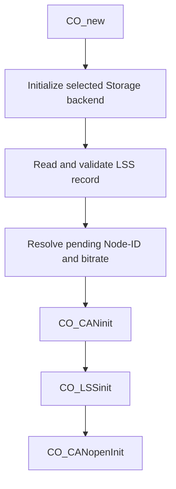

[English](../en/lss-persistence.md)

# LSS Node-ID 与 bitrate 持久化

本页说明 RT-Thread 端如何使用现有 RT-Thread Storage backend 保存和加载 LSS Node-ID/bitrate。该实现使用一个独立的单槽记录，不复用 `OD_PERSIST_COMM` 的数据布局。

## 适用范围

启用该功能后，启动顺序为：



这样第一次 `CO_CANinit()` 就能使用保存的 bitrate。普通 Communication Reset 只使用当前 RAM 中的 LSS pending 值，不重新读取 Storage backend；Reset Node 或真实重新上电后，应用初始化路径会再次读取持久记录。

当前功能提供：

- 单槽记录的读取、格式校验、CRC 校验和 commit 校验；
- 单槽写入原语，按“先使旧 commit 无效，最后提交新 commit”的顺序写入并 readback；
- 启动前加载 Node-ID/bitrate；
- bitrate 校验使用 CANopen LSS 标准 bit timing table。

仅启用本功能不会自动注册 LSS Store callback，也不会执行运行时 bitrate activate。LSS Store 协议接入和运行时 bitrate 切换需要由后续应用逻辑显式连接。

## Kconfig

```text
PKG_CANOPENNODE_USING_LSS_SLAVE=y
PKG_CANOPENNODE_USING_STORAGE=y
PKG_CANOPENNODE_LSS_PERSIST=y
```

`PKG_CANOPENNODE_LSS_PERSIST` 对所有已选择的 RT-Thread Storage backend 都可用，不再依赖特定 backend，也不依赖 `PKG_CANOPENNODE_STORAGE_PERSIST_COMM`。

- DFS uses a backend-owned `*_storage_aux.bin` file.
- The built-in AT24CXX backend reserves the final page of its configured Storage region automatically.
- A user backend must implement `aux_read` and `aux_write` in `CO_storage_rtt_backend_ops_t`.

## 单槽记录格式

固定记录长度为 16 bytes：

| Offset | 长度 | 字段 | 说明 |
|---:|---:|---|---|
| 0 | 4 | magic | ASCII `LSS1` |
| 4 | 1 | formatVersion | 当前为 `1` |
| 5 | 1 | flags | 当前必须为 `0` |
| 6 | 2 | length | 固定为 `16`，little-endian |
| 8 | 1 | nodeId | `1..127` 或 `0xFF` |
| 9 | 1 | reserved | 必须为 `0` |
| 10 | 2 | bitrate | kbit/s，little-endian |
| 12 | 2 | crc16 | 对 byte `0..11` 计算 CRC16-CCITT |
| 14 | 2 | commit | 有效值 `0xA55A` |

加载时只有完整通过 magic/version/length/reserved/CRC/commit、Node-ID 和 LSS timing-table 校验的记录才会覆盖应用启动值。

记录使用 byte-oriented C 结构体定义；CRC 与 commit 操作所需的记录长度和字段边界通过 `sizeof()` 与 `offsetof()` 推导，不再重复维护数值偏移宏。

## 写入与掉电行为

单槽写入顺序：

```text
写 invalid commit
 -> 写 body + CRC
 -> readback body
 -> 写 valid commit
 -> readback full record
 -> 完整校验
```

该设计保证“半写记录不会被下次启动当作有效配置”，但单槽方案不保留上一版本。如果在写入过程中掉电，下一次启动可能发现记录无效并回退到应用传入的默认 Node-ID/bitrate。这是单槽方案的明确行为边界，不提供双槽 rollback。

## Reset 语义

- 初次应用启动：初始化 Storage 后读取 LSS record，再执行第一次 `CO_CANinit()`。
- Communication Reset：重建 `CO_t` 并重新绑定 Storage，但不重新读取 LSS record，保留 LSS 已经修改的 RAM pending 值。
- Reset Node / power-cycle：重新走应用初始化，重新读取持久 record。

这与 CANopenNode LSS 对 pending Node-ID/bitrate 的生命周期要求一致：持久值在程序启动后初始化，Communication Reset 不应覆盖已经配置的 pending 值。

## 错误处理

以下情况不会把未验证数据传入 `CO_CANinit()`：

- empty storage record；
- magic/version/length/reserved/commit 不匹配；
- CRC 错误；
- Node-ID 非法；
- bitrate 不在 CANopen LSS 标准 timing table 中；
- storage backend read 失败。

除 Storage 自身初始化的致命错误外，LSS record 无效时应用保留启动参数继续初始化 CAN。目标板仍应验证 reset、真实 power-cycle 和 Storage backend failure场景。
