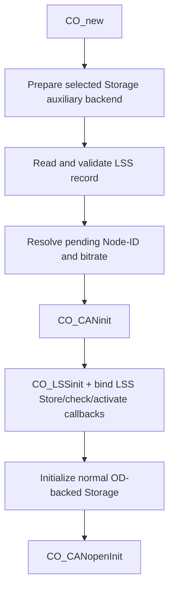

[English](../en/lss-persistence.md)

# LSS Node-ID 与 bitrate 持久化

本页说明 RT-Thread 端如何使用现有 RT-Thread Storage backend 保存和加载 LSS Node-ID/bitrate。该实现使用一个独立的单槽记录，不复用 `OD_PERSIST_COMM` 的数据布局。

## 适用范围

启用该功能后，启动顺序为：



这样第一次 `CO_CANinit()` 就能使用保存的 bitrate，同时不会在 CAN 初始化前调用正常 OD-backed Storage 的 `init`。普通 Communication Reset 只使用当前 RAM 中的 LSS pending 值，不重新读取持久记录；Reset Node 或真实重新上电后，应用初始化路径会再次读取记录。

当前功能提供：

- `CO_storage_rtt_backend_ops_t` 中独立的 `aux_init` / `aux_read` / `aux_write` auxiliary contract；
- 单槽记录的读取、格式校验、CRC 校验和 commit 校验；
- 单槽写入原语，按“先使旧 commit 无效，最后提交新 commit”的顺序写入；
- valid commit 写入后的完整记录 readback、decode、CRC、Node-ID 和 bitrate 复核；
- 启动前加载 Node-ID/bitrate；
- `CO_LSSslave_initCfgStoreCall()` 与 RT-Thread 单槽持久化的连接；
- `CO_LSSslave_initCkBitRateCall()` 对标准 LSS bitrate 的支持检查；
- `CO_LSSslave_initActBitRateCall()` 与非阻塞 PRE_DELAY -> SWITCH -> POST_DELAY 运行时切速状态机；
- `CO_CANmodule_t::txEnabled` 原子发送门控，由 `CO_CANsend()` 在前后 delay 窗口抑制新的 CANopen 发送；
- `CO_RTT_CANsetBitrate()` 通过 RT-Thread CAN driver 切换运行时 bitrate，并复用正常模式恢复流程；
- bitrate 校验使用 CANopen LSS 标准 bit timing table；
- 仅当持久化 bitrate 与应用启动 bitrate 不同时，CAN 初始化失败才回退并重试启动 bitrate。

本功能会处理 LSS `Store configuration (0x17)`、`Configure Bit Timing (0x13)` 和 `Activate Bit Timing (0x15)`。运行时切速使用 RT-Thread `RT_CAN_CMD_SET_BAUD`，当前 STM32F407 bxCAN 目标的 RT-Thread 驱动表覆盖 10/20/50/125/250/500/800/1000 kbit/s。

## Kconfig

```text
PKG_CANOPENNODE_USING_LSS_SLAVE=y
PKG_CANOPENNODE_USING_STORAGE=y
PKG_CANOPENNODE_LSS_PERSIST=y
```

`PKG_CANOPENNODE_LSS_PERSIST` 对所有已选择的 RT-Thread Storage backend 都可用，不再依赖特定 backend，也不依赖 `PKG_CANOPENNODE_STORAGE_PERSIST_COMM`。

- DFS 使用 backend 自己管理的 `*_storage_aux.bin` 文件保存 auxiliary 数据，并通过独立 `aux_init` 在第一次 CAN 初始化前绑定实例。
- 通用 EEPROM Storage backend 通过 EEPROM device provider 访问介质；内置 AT24CXX provider 会自动保留配置 Storage 区域的最后一个 EEPROM page 作为 auxiliary 区域。
- 自定义 EEPROM provider 可以使用强符号替换内置 weak provider，需要实现 `co_storage_rtt_eeprom_module_get()` 和整组 `CO_eeprom_*` target hooks；启用 LSS persistence 时还需要实现 `co_storage_rtt_eeprom_provider_aux_init()`、`co_storage_rtt_eeprom_aux_read()` 与 `co_storage_rtt_eeprom_aux_write()`。
- 用户自定义 Storage backend 需要在 `CO_storage_rtt_backend_ops_t` 中实现 `aux_init`、`aux_read` 和 `aux_write`。其中 `aux_init` 是独立的 pre-CAN auxiliary 准备入口，不再复用正常 Storage `init`。

对于 AT24CXX backend，`PKG_CANOPENNODE_STORAGE_AT24C_OFFSET` 和 `PKG_CANOPENNODE_STORAGE_AT24C_REGION_SIZE` 仍定义由本软件包占用的完整 Storage 区域。启用 LSS persistence 时，该区域必须大于一个 EEPROM page，因为最后一个 page 会保留给 auxiliary persistence，正常 CANopen Storage 只能使用前面的区域。

## 单槽记录格式

固定记录长度为 16 bytes：

| Offset | 长度 | 字段 | 说明 |
|---:|---:|---|---|
| 0 | 4 | magic | ASCII `LSS1` |
| 4 | 1 | formatVersion | 当前为 `1` |
| 5 | 1 | flags | 当前必须为 `0` |
| 6 | 2 | length | 固定为 `16`，little-endian |
| 8 | 1 | nodeId | `1..127` 或 `0xFF` |
| 9 | 1 | reserved | 必须为 `0` |
| 10 | 2 | bitrate | kbit/s，little-endian |
| 12 | 2 | crc16 | 对 byte `0..11` 计算 CRC16-CCITT |
| 14 | 2 | commit | 有效值 `0xA55A` |

加载时只有完整通过 magic/version/length/reserved/CRC/commit、Node-ID 和 LSS timing-table 校验的记录才会覆盖应用启动值。

记录使用 byte-oriented C 结构体定义；CRC 与 commit 操作所需的记录长度和字段边界通过 `sizeof()` 与 `offsetof()` 推导，不再重复维护数值偏移宏。

## LSS callback 连接

`co_app_rtt_lss_init()` 在 `CO_LSSinit()` 成功后显式注册三个 callback：

```c
CO_LSSslave_initCfgStoreCall(app->canOpenStack->LSSslave,
                             app,
                             co_app_rtt_lss_store_config);
CO_LSSslave_initCkBitRateCall(app->canOpenStack->LSSslave,
                              app,
                              co_app_rtt_lss_check_bitrate);
CO_LSSslave_initActBitRateCall(app->canOpenStack->LSSslave,
                               app,
                               co_app_rtt_lss_activate_bitrate);
```

CANopenNode 收到 LSS `0x17` 后，会把当前 pending Node-ID 和 bitrate 同步传入 Store callback。callback 调用 `co_lss_persist_rtt_store()`；只有单槽记录完整提交并完成最终 readback/validation 后才返回 `true`，CANopenNode 才回复 Store success。

Bitrate check/activate 也直接在同一个初始化函数中绑定，不使用宏替换或 `rt_device_write()` 劫持。Communication Reset 会删除并重新创建 `CO_t`，因此这三个 callback 都放在 `co_app_rtt_lss_init()` 中注册，确保新的 LSS slave object 会重新完成绑定。

## 运行时 bitrate activate

Configure Bit Timing 只接受 CANopen LSS 标准表中的 10/20/50/125/250/500/800/1000 kbit/s。对于当前 STM32F407 目标，这些值也都存在于 RT-Thread bxCAN baud table；实际切换时仍以 `RT_CAN_CMD_SET_BAUD` 返回值作为最终硬件结果。

Activate Bit Timing callback 本身不阻塞、不 sleep，也不直接切换 CAN 硬件。callback 只记录旧/新 bitrate 和 delay，原子关闭 `CO_CANsend()` 的软件 TX gate，并立即进入 PRE_DELAY；后续由 mainline 周期推进：

```text
IDLE
 -> PRE_DELAY
 -> SWITCH
 -> POST_DELAY
 -> IDLE
```

状态行为：

1. callback 调用 `CO_RTT_CANsetTxEnabled(CANmodule, false)`，使后续新进入 `CO_CANsend()` 的 CANopen 发送被有意抑制；被抑制的发送返回 `CO_ERROR_NO`，不会把协议要求的静默误报成 TX overflow/系统错误；
2. PRE_DELAY 期间 mainline/realtime 仍可正常执行，但任何经 `CO_CANsend()` 发起的新 CANopen TX 都会被 gate；
3. 到达切换点后，mainline 使用 `lifecycleMutex` 排除 realtime worker，并调用 `CO_RTT_CANsetBitrate()`；该函数执行 `RT_CAN_CMD_SET_BAUD`，随后复用 `CO_CANsetNormalMode()` 的 filter/RX/start 流程恢复控制器；
4. POST_DELAY 期间控制器可以已经处于 `CANnormal=true`，但 `txEnabled` 仍保持关闭，因此新的 CANopen TX 继续被抑制；
5. POST_DELAY 到期后重新 `CO_RTT_CANsetTxEnabled(..., true)`，恢复 CANopen 发送；
6. 成功后 `app->baudrate` 更新为新的 active bitrate，`lssPendingBitrate` 保持 LSS 配置值，后续 Store 可保存该值。

如果目标 bitrate 切换失败，代码尝试恢复切换前 bitrate。回退成功时恢复通信并把 RAM pending bitrate 恢复为原值；如果连回退也失败，则保持 `txEnabled=false` 和 `CANnormal=false`，要求 Reset Node、power-cycle 或 bitrate rescue 流程恢复。

当前实现的静默边界明确限定在 CANopen 软件层：`txEnabled=false` 阻止的是尚未进入 RT-Thread/HAL TX 路径的新 `CO_CANsend()`。如果某一帧在 gate 关闭前已经进入 `rt_device_write()` 或硬件 mailbox，当前实现不会中止该帧。后续 RT-Thread CAN driver 若提供基于 `HAL_CAN_AbortTxRequest()` 的 target TX-abort API，可在进入 PRE_DELAY 前补充硬件 pending-TX 清理，而无需改变当前 LSS 状态机主体。应用同样不应在 LSS activate 窗口绕过 CANopenNode，直接对同一 CAN device 调用 `rt_device_write()`。

## 写入与掉电行为

单槽写入顺序：

```text
写 invalid commit
 -> 写 body + CRC
 -> readback 并比较 body
 -> 写 valid commit
 -> readback 完整记录
 -> 校验 magic/version/length/reserved/CRC/commit/Node-ID/bitrate
 -> 成功后返回 true
```

如果 valid commit 写接口失败，代码会尽力再次写入 invalid marker 后返回失败。如果 valid commit 已经写入，但最终完整 readback 或 decode/compare 失败，也会尽力重新写 invalid marker，然后向 LSS Master 返回 Store failed。

这里的重新 invalidate 是 best-effort：如果最终校验失败后介质同时也拒绝 invalidate 写入，调用仍返回失败，但介质上可能保留此前已提交的有效记录。该边界无法通过单槽和普通 read/write contract 完全消除；需要更强 rollback 语义时应由产品使用双槽或原子后端。

单槽方案不保留上一版本。如果在 invalid commit 写入后、valid commit 完成前掉电，下一次启动会发现记录无效并回退到应用传入的默认 Node-ID/bitrate。这是单槽方案的明确行为边界。

## Reset 语义

- 初次应用启动：先执行 auxiliary backend 准备并读取 LSS record，再执行第一次 `CO_CANinit()`；随后初始化 LSS、绑定 Store/check/activate callbacks，再执行正常 OD-backed Storage 初始化。
- Communication Reset：重建 `CO_t`，保留 RAM 中已经配置的 pending Node-ID/bitrate，不重新读取 LSS record；新的 LSS object 会重新绑定 Store/check/activate callbacks，新的 CAN module 会重新初始化 `txEnabled=true`。
- Reset Node / power-cycle：重新走应用初始化，重新读取持久 record。

这与 CANopenNode LSS 对 pending Node-ID/bitrate 的生命周期要求一致：持久值在程序启动后初始化，Communication Reset 不应覆盖已经配置的 pending 值。

## 使用原始 CAN 帧验证 Node-ID configure/store

对于仅验证 Node-ID 修改与持久化的测试，不需要在 MCU 侧再实现 LSS Master。可以在 Linux Host 使用 SocketCAN/can-utils 直接发送 CiA 305 LSS 帧。

CAN-ID：

```text
LSS Master -> Slave : 0x7E5
LSS Slave  -> Master: 0x7E4
NMT                  : 0x000
```

先读取 DUT OD `0x1018:01..04`，然后按 little-endian 发送 selective 四步：

```text
7E5#40VVVVVVVV000000
7E5#41PPPPPPPP000000
7E5#42RRRRRRRR000000
7E5#43SSSSSSSS000000
```

最后一帧匹配后期望：

```text
7E4#4400000000000000
```

假设测试 Node-ID 为 `0x22`：

```text
# Configure Node-ID
7E5#1122000000000000
# expected: 7E4#1100000000000000

# Store configuration
7E5#1700000000000000
# expected: 7E4#1700000000000000
```

Configure 后、Communication Reset 前，`Inquire Node-ID (0x5E)` 返回的是 active Node-ID，而不是 pending Node-ID。因此此时查询仍可能返回旧 ID，这是 CANopenNode 当前语义，不表示 configure 失败。

如果旧 active Node-ID 为 1，应用新的 pending Node-ID：

```text
000#8201
```

期望看到新节点的 boot-up，例如 Node-ID `0x22`：

```text
722#00
```

Node-ID 持久化验收还应继续执行：

1. 对当前 Node-ID 发送 NMT Reset Node (`0x81`)；
2. 确认复位后仍以保存的新 Node-ID 上线；
3. 真实断电/上电；
4. 确认仍使用保存的新 Node-ID；
5. 最后使用 LSS configure + Store 恢复原 Node-ID，再 reset/power-cycle 复核。

## Bitrate 验证要点

建议先以 1000 kbit/s 启动 DUT，selective 进入 LSS configuration state 后：

1. Configure Bit Timing 到 500 kbit/s，期望收到成功响应；
2. 发送非法/不支持的 timing table 组合，期望错误响应或 no-ack，且 pending bitrate 不改变；
3. 发送 Activate Bit Timing，并使用同一个 switch delay 同步切换 Host SocketCAN；
4. 在 PRE_DELAY/POST_DELAY 期间确认 CANopen 层不再产生新的发送，并验证切速窗口结束前不会恢复 heartbeat/SDO 等正常发送；本项验证不把“gate 关闭前已经进入 HAL mailbox 的历史 TX 被强制 abort”作为验收条件；
5. delay 结束后在 500 kbit/s 验证 LSS/SDO/heartbeat 通信；
6. Store configuration，执行 Reset Node，再真实 power-cycle；
7. Host 从 500 kbit/s 重新发现 DUT，确认持久 bitrate 生效；
8. 最后恢复 1000 kbit/s，Store、Reset Node、power-cycle 再复核。

代码实现完成不等于目标板验收通过；目标板实测仍需验证 Host 同步切速、实际 bxCAN 重配置、CANopen 软件 TX gate、Store/Reset/power-cycle 和 rescue。严格硬件 mailbox abort 可在 RT-Thread target driver 后续提供对应 API 后补充。

## 错误处理

以下情况不会把未验证数据传入 `CO_CANinit()`：

- empty storage record；
- magic/version/length/reserved/commit 不匹配；
- CRC 错误；
- Node-ID 非法；
- bitrate 不在 CANopen LSS 标准 timing table 中；
- storage backend read 失败。

Store 时，body readback、commit write、最终完整 readback 或最终 decode/compare 任一步失败都会向 CANopenNode 返回 `false`，对应 LSS Store failed。

如果已经加载了有效持久记录，但第一次 `CO_CANinit()` 失败，仅当持久化 bitrate 与应用启动 bitrate 不同时才使用启动参数重试。`CO_CANinit()` 实际依赖的是 bitrate，因此两者相同时再次调用只会重复同一次 CAN 初始化，不再重试。

运行时切速失败时先尝试回退到切换前 bitrate；回退也失败时保持 CANopen TX disabled，避免在未知 bitrate/控制器状态下继续产生新的发送。

除 Storage 自身初始化的致命错误外，LSS record 无效时应用保留启动参数继续初始化 CAN。目标板仍应验证 Reset Communication、Reset Node、真实 power-cycle、Storage backend failure、500/1000 kbit/s 双向切换和 rescue 场景。
