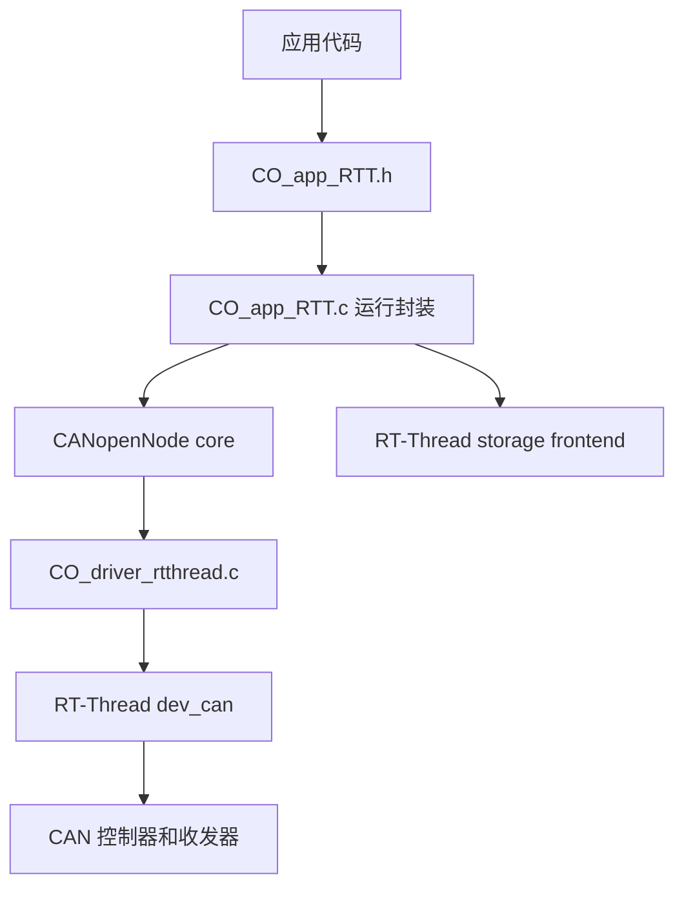
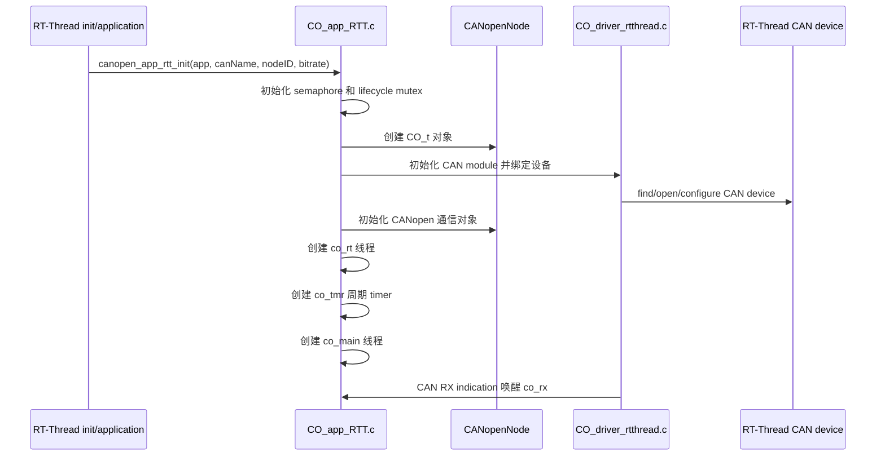
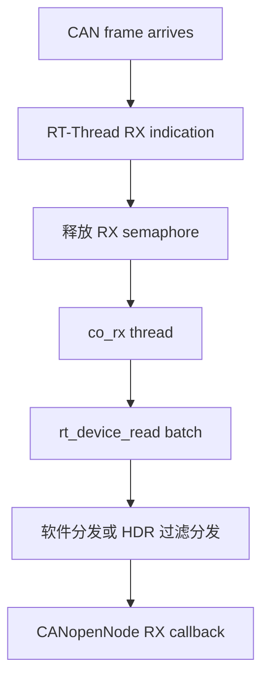

[English](../en/rt-thread-integration.md)

# RT-Thread 集成说明

本文说明本移植层如何将 CANopenNode 绑定到 RT-Thread 设备、线程、定时器和同步原语。

## 1. 分层结构



本移植层主要承担两个职责：

1. `CO_driver_rtthread.c` 基于 RT-Thread `dev_can` 实现 CANopenNode target driver hooks。
2. `CO_app_RTT.c` 持有应用运行实例，创建 CANopenNode 对象，启动 worker threads，处理 communication reset，并可选初始化 storage 和 LED 输出。

## 2. 运行实例

面向应用的对象是 `CO_app_RTT.h` 中的 `CANopenNodeRTT`。

关键字段如下：

| 字段 | 含义 |
|---|---|
| `canName` | RT-Thread CAN 设备名，仅保存指针。 |
| `desiredNodeID` | 请求使用的 CANopen Node-ID。 |
| `activeNodeID` | CANopen 通信初始化后的实际 Node-ID。 |
| `baudrate` | CAN bitrate，单位 kbit/s。 |
| `canOpenStack` | 当前实例持有的 `CO_t` 对象。 |
| `mainThread` | mainline CANopen worker thread。 |
| `rtThread` | realtime CANopen worker thread。 |
| `rtTimer` | 周期性唤醒 realtime 处理的 RT-Thread timer。 |
| `rtSem` | realtime 唤醒信号量。 |
| `lifecycleMutex` | communication reset 期间保护 stack 删除和重建。 |

手动初始化接口为：

```c
rt_err_t canopen_app_rtt_init(CANopenNodeRTT *app,
                              const char *canName,
                              uint8_t nodeID,
                              uint16_t bitrate);
```

实例首次使用前必须为零初始化。`canName` 不会被复制，因此该字符串存储在实例生命周期内必须保持有效。

## 3. 启动顺序



mainline 线程最后启动，因为它可能处理 `CO_RESET_COMM` 并重建 CANopen stack。该路径运行前，realtime 同步对象必须已经构造完成。

## 4. 线程和定时器

| 运行对象 | 默认名称 | 职责 |
|---|---|---|
| RX helper thread | `co_rx` | 从 RT-Thread CAN 设备读取帧，并分发 CANopenNode receive callback。 |
| Mainline thread | `co_main` | 执行 `CO_process()`，处理 NMT、SDO、heartbeat、storage auto processing、LED 状态和 reset 命令。 |
| Realtime thread | `co_rt` | 在对应对象启用时处理 SYNC、SRDO、RPDO 和 TPDO 实时路径。 |
| Realtime timer | `co_tmr` | 周期性释放 `rtSem`，唤醒 `co_rt`。 |

realtime 请求周期由 `PKG_CANOPENNODE_TIMER_PERIOD_US` 配置。封装层会将周期换算为 RT-Thread tick，因此过小的值会受到 BSP tick rate 限制。

## 5. CAN 接收路径



RX helper 每轮最多读取 `PKG_CANOPENNODE_RX_BATCH_SIZE` 帧。增大 batch 可以降低唤醒和读取开销，但会增加 RX 线程栈使用。

当 `RT_CAN_USING_HDR` 和 `PKG_CANOPENNODE_USING_RTT_CAN_FILTER` 同时启用时，驱动会尝试配置 RT-Thread CAN HDR 过滤器。如果硬件过滤器配置不可用，则回退到软件分发。

## 6. CAN 发送路径

CANopenNode 发送 buffer 由 `CO_CANtx_t` 承载，包含标准 CAN identifier、DLC、payload、`bufferFull` 和同步 PDO 标志。驱动通过 RT-Thread CAN 设备提交帧，并将 RT-Thread write 结果映射为 CANopenNode 返回码。

应用代码如果直接访问 CANopenNode 发送状态，必须遵守 CANopenNode locking macros：

```c
CO_LOCK_CAN_SEND(CANmodule);
/* Access transmit-buffer state. */
CO_UNLOCK_CAN_SEND(CANmodule);
```

不要在 ISR 上下文直接调用可能获取 RT-Thread mutex 的 CANopenNode API。ISR 中的工作应延迟到线程执行。

## 7. OD、EMCY 与锁边界

RT-Thread target 层提供以下 locking macros：

| Macro | 保护范围 |
|---|---|
| `CO_LOCK_CAN_SEND` / `CO_UNLOCK_CAN_SEND` | CANopenNode transmit buffer 状态。 |
| `CO_LOCK_EMCY` / `CO_UNLOCK_EMCY` | Emergency object 状态。 |
| `CO_LOCK_OD` / `CO_UNLOCK_OD` | 可被 PDO 映射的 Object Dictionary 访问。 |

应用代码与 CANopenNode 处理线程共享 OD、EMCY 或 CAN send 状态时，应使用这些锁。

## 8. Communication reset

mainline 线程检查 `CO_process()` 返回值。当 CANopenNode 请求 communication reset 时，封装层会停止 realtime 处理，通过 `lifecycleMutex` 保护 stack 生命周期，禁用 CAN module，删除当前 CANopen stack 对象，重新创建对象并重启通信。

该设计用于避免 realtime 处理在 `app->canOpenStack` 被删除和重建时继续解引用旧对象。

## 9. Storage 集成

当 `PKG_CANOPENNODE_USING_STORAGE` 启用时，每个 `CANopenNodeRTT` 实例持有一个 `CO_storage_t` 和一组 storage entry table。选择的 backend 从 `port/rtthread/storage/` 编译，并由 Kconfig 决定。

可选 backend 如下：

| Backend | 适用场景 |
|---|---|
| DFS | 通过 RT-Thread DFS 做文件持久化。 |
| EEPROM | 基于 AT24CXX 的 EEPROM 持久化，限制为单实例。 |
| User | 板级或应用自定义 flash、filesystem、NVM 或 fail-safe storage。 |

## 10. 集成规则

- CAN 设备名必须在实例生命周期内保持稳定。
- 当 PDO/SYNC/SRDO 时序重要时，realtime 线程优先级应高于 mainline 线程。
- 不要对同一逻辑节点同时启用 auto init 和 manual init。
- 不要在 ISR 上下文调用会获取锁的 CANopenNode API。
- 产品固件发布前应替换 demo OD。
- `CO_RESET_COMM` 是正常 CANopen 生命周期事件；应用持有的旧 `CO_t` 对象内部引用不能跨 reset 继续使用。
