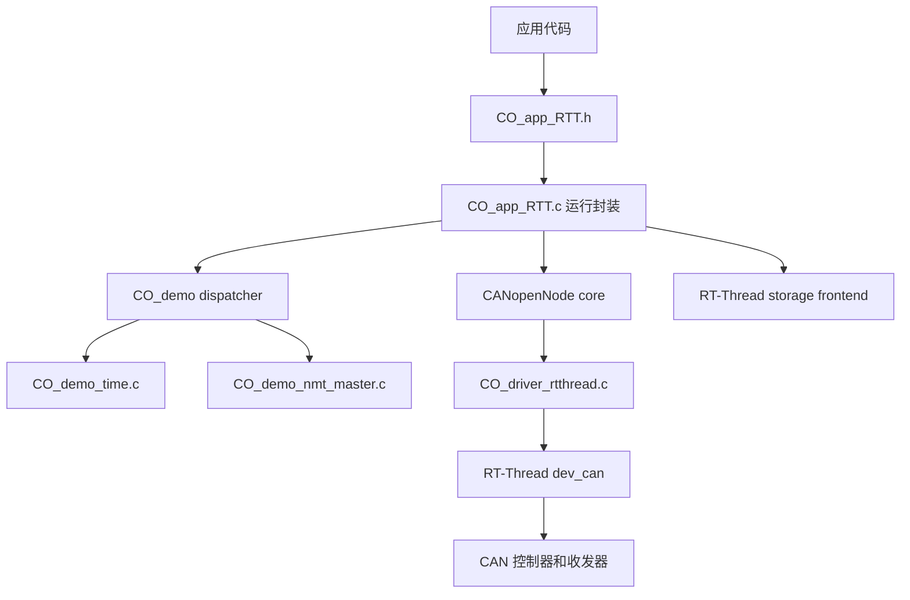
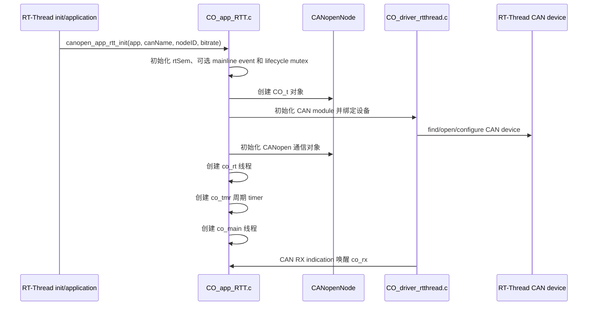
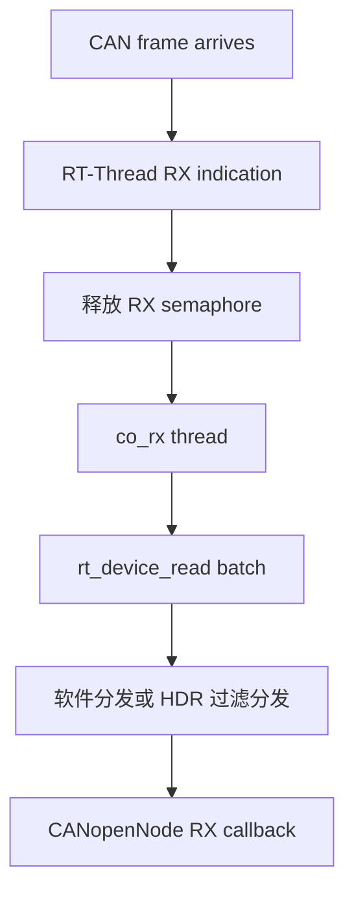

[English](../en/rt-thread-integration.md)

# RT-Thread 集成说明

本文说明本移植层如何将 CANopenNode 绑定到 RT-Thread 设备、线程、定时器和同步原语。

## 1. 分层结构


```mermaid
flowchart TD
    UserApp[应用代码] --> AppAPI[CO_app_RTT.h]
    AppAPI --> Runtime[CO_app_RTT.c 运行封装]
    Runtime --> Demo[CO_demo dispatcher]
    Demo --> DemoTime[CO_demo_time.c]
    Demo --> DemoNmt[CO_demo_nmt_master.c]
    Runtime --> CANopen[CANopenNode core]
    Runtime --> Storage[RT-Thread storage frontend]
    CANopen --> Target[CO_driver_rtthread.c]
    Target --> DevCAN[RT-Thread dev_can]
    DevCAN --> Controller[CAN 控制器和收发器]
```

本移植层主要承担两个职责：

1. `CO_driver_rtthread.c` 基于 RT-Thread `dev_can` 实现 CANopenNode target driver hooks。
2. `CO_app_RTT.c` 持有应用运行实例，创建 CANopenNode 对象，启动 worker threads，处理 communication reset，并可选初始化 storage 和 LED 输出。
3. `port/rtthread/demo/` 持有可选 demo 功能实现；运行封装只调用固定的 `CO_demo_init()`、`CO_demo_bind()`、`CO_demo_process()`、`CO_demo_reset()`，以及仅用于初始化回滚的 `CO_demo_deinit()` 接点。

## 2. 运行实例

面向应用的对象是 `CO_app_RTT.h` 中的 `CANopenNodeRTT`。

关键字段如下：

| 字段 | 含义 |
|---|---|
| `canName` | RT-Thread CAN 设备名，仅保存指针。 |
| `desiredNodeID` | 请求使用的 CANopen Node-ID。 |
| `activeNodeID` | CANopen 通信初始化后的实际 Node-ID。 |
| `baudrate` | CAN bitrate，单位 kbit/s。 |
| `canOpenStack` | 当前实例持有的 `CO_t` 对象。 |
| `demo` | 可选 demo dispatcher 状态，具体功能状态由 `CO_demo_*` 模块维护。 |
| `mainThread` | mainline CANopen worker thread。 |
| `rtThread` | realtime CANopen worker thread。 |
| `rtTimer` | 周期性唤醒 realtime 处理的 RT-Thread timer。 |
| `rtSem` | realtime 唤醒信号量。 |
| `lifecycle` | 有 extension 时存在的可配置固定容量 `ops + context + optional release` 注册表；dispatcher 不识别 profile 类型。 |
| `mainline` | 开启 `PKG_CANOPENNODE_GLOBAL_TIMERNEXT` 时使用的事件驱动 mainline 调度状态。 |
| `lifecycleMutex` | communication reset 期间保护 stack 删除和重建。 |

手动初始化接口为：

```c
rt_err_t canopen_app_rtt_init(CANopenNodeRTT *app,
                              const char *canName,
                              uint8_t nodeID,
                              uint16_t bitrate);
```

实例首次使用前必须为零初始化。`canName` 不会被复制，因此该字符串存储在实例生命周期内必须保持有效。

## 3. 启动顺序


```mermaid
sequenceDiagram
    participant App as RT-Thread init/application
    participant Wrapper as CO_app_RTT.c
    participant Core as CANopenNode
    participant Driver as CO_driver_rtthread.c
    participant CAN as RT-Thread CAN device

    App->>Wrapper: canopen_app_rtt_init(app, canName, nodeID, bitrate)
    Wrapper->>Wrapper: 初始化 rtSem、可选 mainline event 和 lifecycle mutex
    Wrapper->>Core: 创建 CO_t 对象
    Wrapper->>Driver: 初始化 CAN module 并绑定设备
    Driver->>CAN: find/open/configure CAN device
    Wrapper->>Core: 初始化 CANopen 通信对象
    Wrapper->>Wrapper: 创建 co_rt 线程
    Wrapper->>Wrapper: 创建 co_tmr 周期 timer
    Wrapper->>Wrapper: 创建 co_main 线程
    Driver->>Wrapper: CAN RX indication 唤醒 co_rx
```

mainline 线程最后启动，因为它可能处理 `CO_RESET_COMM` 并重建 CANopen stack。该路径运行前，realtime 同步对象必须已经构造完成。

启用 lifecycle autostart 时，各 profile factory 在 RT-Thread component init 阶段先注册；唯一的默认 app `INIT_APP_EXPORT` 入口随后在 `canopen_app_rtt_init()` 前调用 `CO_RTT_lifecycleAutoAttachAll()`。Auto factory 只负责创建/注册 owned context；真正创建 RT 资源和启动 extension 的入口仍只有 `CO_RTT_lifecycleRuntimeInit()` 与 `CO_RTT_lifecycleRuntimeStart()`。任一 factory 失败时，仅逆序回滚本次新增的 auto slot，不影响此前已注册的 manual prefix。

### Demo 扩展边界

`CO_app_RTT.c` 不直接实现 具体可选 demo module 功能。通信对象初始化成功后调用 `CO_demo_bind()` 重新绑定 callback；每轮 `CO_process()` 后调用 `CO_demo_process()`；本机 communication/application reset 前调用 `CO_demo_reset()`；仅在初始化失败且 CAN RX 已停止后调用 `CO_demo_deinit()` 回收 callback owner。SConscript 仅在 demo OD 开启且至少一个 demo module被选择时加入 dispatcher，并根据各 demo 的 Kconfig 选项选择对应实现源文件；未选择任何 demo module时，dispatcher state 与 hook 调用会整体编译掉，不再使用 dummy/no-op 状态。因此后续新增 demo module 只扩展 `port/rtthread/demo/`、Kconfig 和 SConscript 选择，不需要继续修改主运行封装。

## 4. 线程和定时器

| 运行对象 | 默认名称 | 职责 |
|---|---|---|
| RX helper thread | `co_rx` | 从 RT-Thread CAN 设备读取帧，并分发 CANopenNode receive callback。 |
| Mainline thread | `co_main` | 执行 `CO_process()`，处理 NMT、SDO、heartbeat、storage auto processing、LED 状态和 reset 命令。 |
| Realtime thread | `co_rt` | 在对应对象启用时处理 SYNC、SRDO、RPDO 和 TPDO 实时路径。 |
| Realtime timer | `co_tmr` | 周期性先释放 `rtSem`，再调用通用 lifecycle realtime hook；CiA 402 hook 释放 `cia402Sem`。 |
| CiA 402 thread | `co_402` | CiA 402 Device attach 后运行一次 Pure-C PDS supervisor；默认 priority 5。 |
| Mainline event | `co_evt` | 开启 `PKG_CANOPENNODE_GLOBAL_TIMERNEXT` 后，合并 callback-pre 与 runtime 的 mainline 唤醒通知。 |

realtime 请求周期由 `PKG_CANOPENNODE_TIMER_PERIOD_US` 配置。封装层会将周期换算为 RT-Thread tick，因此过小的值会受到 BSP tick rate 限制。

`PKG_CANOPENNODE_GLOBAL_TIMERNEXT=n` 时，`co_main` 保留原有 1 ms polling，SCons 也不会编译 `CO_mainline_RTT.c`。开启后由 `CO_mainline_RTT.c` 负责 Event 生命周期、callback-pre 唤醒、等待策略和 wrapper deadline 聚合，`CO_app_RTT.c` 只在明确的功能宏调用点接入调度器。`CO_process()` 与 wrapper 自有逻辑共同给出最近 deadline，callback-pre 和 Gateway 输入则通过 mainline event 提前唤醒线程。Event bit 只表达“有工作需要重新处理”，协议状态和接收数据仍由 CANopenNode 自身维护。402 关闭时不会选择 lifecycle registry，realtime 路径继续严格保持 `co_tmr -> rtSem -> co_rt`。CiA 402 Device attach 后，同一 timer 调用通用 realtime hook，
CiA 402 hook 再唤醒 `cia402Sem -> co_402`；该 hook 与 timerNext mainline 配置无关，也不把 PDS supervisor 插入 `co_rt` 的 SYNC/RPDO/TPDO/SRDO 顺序。

## 5. CAN 接收路径


```mermaid
flowchart TD
    Frame[CAN frame arrives] --> Indicate[RT-Thread RX indication]
    Indicate --> Sem[释放 RX semaphore]
    Sem --> RxThread[co_rx thread]
    RxThread --> Read[rt_device_read batch]
    Read --> Dispatch[软件分发或 HDR 过滤分发]
    Dispatch --> Callback[CANopenNode RX callback]
```

RX helper 每轮最多读取 `PKG_CANOPENNODE_RX_BATCH_SIZE` 帧。增大 batch 可以降低唤醒和读取开销，但会增加 RX 线程栈使用。

当 `RT_CAN_USING_HDR` 和 `PKG_CANOPENNODE_USING_RTT_CAN_FILTER` 同时启用时，驱动会尝试配置 RT-Thread CAN HDR 过滤器。如果硬件过滤器配置不可用，则回退到软件分发。

## 6. CAN 发送路径

CANopenNode 发送 buffer 由 `CO_CANtx_t` 承载，包含标准 CAN identifier、DLC、payload、`bufferFull` 和同步 PDO 标志。驱动通过 RT-Thread CAN 设备提交帧，并将 RT-Thread write 结果映射为 CANopenNode 返回码。

应用代码如果直接访问 CANopenNode 发送状态，必须遵守 CANopenNode locking macros：

```c
CO_LOCK_CAN_SEND(CANmodule);
/* Access transmit-buffer state. */
CO_UNLOCK_CAN_SEND(CANmodule);
```

不要在 ISR 上下文直接调用可能获取 RT-Thread mutex 的 CANopenNode API。ISR 中的工作应延迟到线程执行。

## 7. OD、EMCY 与锁边界

RT-Thread target 层提供以下 locking macros：

| Macro | 保护范围 |
|---|---|
| `CO_LOCK_CAN_SEND` / `CO_UNLOCK_CAN_SEND` | CANopenNode transmit buffer 状态。 |
| `CO_LOCK_EMCY` / `CO_UNLOCK_EMCY` | Emergency object 状态。 |
| `CO_LOCK_OD` / `CO_UNLOCK_OD` | 可被 PDO 映射的 Object Dictionary 访问。 |

应用代码与 CANopenNode 处理线程共享 OD、EMCY 或 CAN send 状态时，应使用这些锁。

## 8. Communication reset

mainline 线程检查 `CO_process()` 返回值。当 CANopenNode 请求 communication reset 时，封装层先停止 `rtTimer`、drain `rtSem`，并调用通用 `CO_RTT_lifecycleResetWakeups()`。随后获取 `lifecycleMutex`，registry 先以逆注册顺序执行 communication-stop hook；旧 CAN module 禁用并等待 RX thread 退出后，再以逆注册顺序执行 communication-quiesced hook。删除旧 stack 后，新 stack 在 `CO_CANopenInit()` 完成后、SRDO/PDO 初始化前按注册顺序执行 bind hook，进入 CAN normal mode 后执行 ready hook。Auto-owned context 在 Communication Reset 中不会释放；只有最终 teardown 才先执行 `runtimeDeinit()`，再执行 slot release callback。CiA 402 只是其中一个 extension，`CO_app_RTT.c` 不再包含 profile 专属调用。

`co_rt` 与 `co_402` 都按 `lifecycleMutex -> OD lock` 获取锁，并且只在持有 lifecycle mutex 后读取当前 `app->canOpenStack`。因此 reset 不允许 thread 保存或继续使用旧 `CO_t`、`CANmodule` 或 `odMutex` 指针。完整 CiA 402 Device 时序见 [CiA 402 RT-Thread Device Thread](cia402-device-rtt.md)。

## 9. Storage 集成

当 `PKG_CANOPENNODE_USING_STORAGE` 启用时，每个 `CANopenNodeRTT` 实例持有一个 `CO_storage_t` 和一组 storage entry table。选择的 backend 从 `port/rtthread/storage/` 编译，并由 Kconfig 决定。

可选 backend 如下：

| Backend | 适用场景 |
|---|---|
| DFS | 通过 RT-Thread DFS 做文件持久化。 |
| EEPROM | 基于 AT24CXX 的 EEPROM 持久化，限制为单实例。 |
| User | 板级或应用自定义 flash、filesystem、NVM 或 fail-safe storage。 |

## 10. 集成规则

- CAN 设备名必须在实例生命周期内保持稳定。
- 当 PDO/SYNC/SRDO 时序重要时，realtime 线程优先级应高于 mainline 线程。
- 不要对同一逻辑节点同时启用 auto init 和 manual init。
- 不要在 ISR 上下文调用会获取锁的 CANopenNode API。
- 产品固件发布前应替换 demo OD。
- `CO_RESET_COMM` 是正常 CANopen 生命周期事件；应用持有的旧 `CO_t` 对象内部引用不能跨 reset 继续使用。
